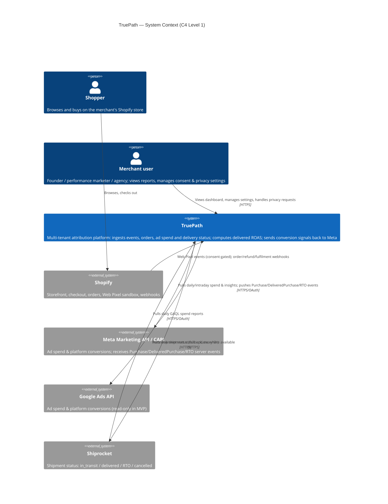
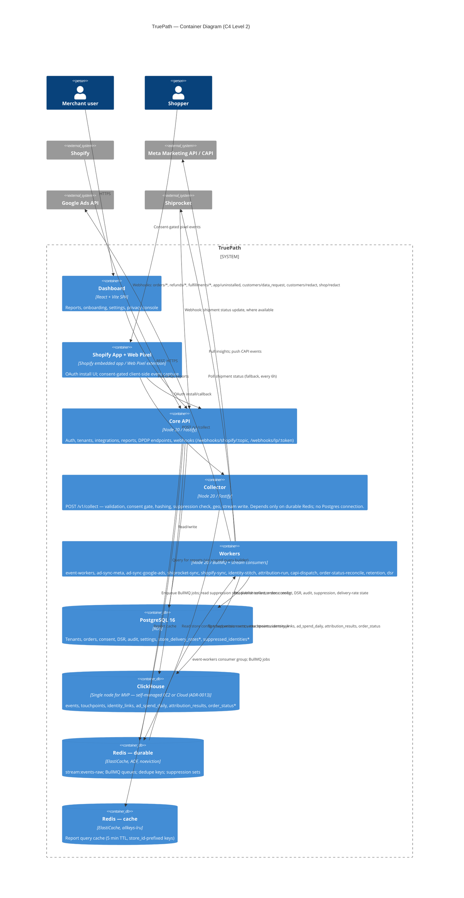
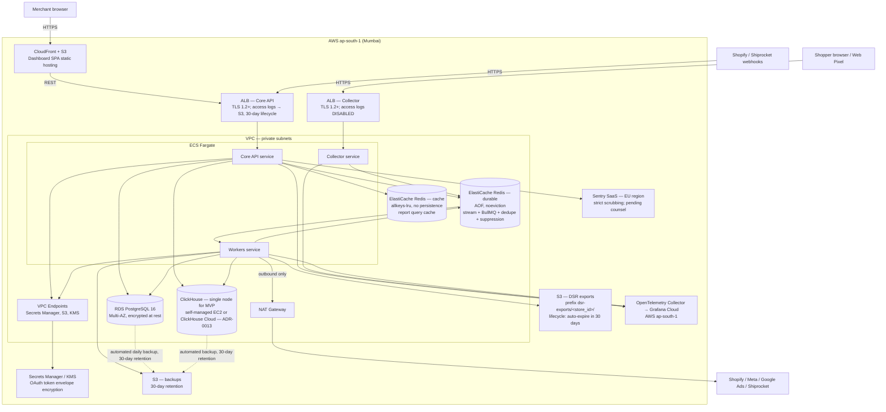

# TruePath — High-Level Design

> Trimmed arc42 structure. Source of truth for scope/stack: [`docs/SPEC.md`](../SPEC.md). This document does not change any decision fixed in the spec; anything the spec leaves open is called out under **Open questions** in the relevant section and tracked as an ADR (see §9). Data-model additions and deviations from SPEC §6 are listed in §8 and **flagged for explicit sign-off**, not silently merged into the spec.

## 1. Introduction & goals

TruePath is a multi-tenant SaaS attribution platform for Indian Shopify D2C brands. It ingests first-party pixel events, Shopify orders, Meta/Google ad spend, and Shiprocket delivery status, stitches them into a single customer journey per shopper, and reports **delivered ROAS** — attributed revenue counted only on delivered orders, excluding RTO — per channel/campaign/ad set/ad, alongside sending improved conversion signals back to Meta via CAPI.

### Top quality goals (ranked)
| # | Goal | Why it's top-5 | Measured by (see §10) |
|---|---|---|---|
| 1 | **DPDP compliance is non-negotiable** | Legal hard requirement (SPEC §5); a single unconsented tracking path or PII leak blocks launch | §5.10 compliance test suite passes in CI on every PR |
| 2 | **Attribution correctness** | The product's entire value proposition is "your real numbers," not Meta's/Google's self-reported ones | Attribution property tests (credits sum to 1, deterministic); reconciliation vs platform-reported spend |
| 3 | **Collector throughput & availability** | Every dropped pixel event is unrecoverable lost data for that shopper's journey | p95 < 50 ms, 99.9% availability, zero event loss once `204` returned **and Redis accepted the write** (see Q2) |
| 4 | **Tenant isolation** | Multi-tenant SaaS storing commercially sensitive ad performance data for competing brands | Cross-tenant access integration test returns 403/404 (§5.10 test 7) |
| 5 | **India data residency & operational cost fit for SMB D2C** | Target customer is ₹10L–₹5Cr GMV; infra spend must stay proportionate; all PII must stay in India | Hosted entirely in AWS ap-south-1; infra cost tracked against a per-tenant budget in review |

### Stakeholders
| Role | Concern |
|---|---|
| Merchant founder / performance marketer | Trustworthy delivered ROAS, fast onboarding, low false RTO attribution |
| Merchant staff (analyst/viewer) | Read-only reporting access, no accidental cross-tenant leakage |
| Shopper (data principal) | Consent respected, rights to access/erase honoured quickly and completely |
| Engineering team (3–4 devs, 14-week build) | Buildable in-scope, boring/well-documented libraries, adapters isolate volatile external APIs |
| Legal/compliance reviewer | DPDP mapping is an engineering interpretation and must be auditable; see §8 flag on consent-evidence-vs-erasure tension |
| Data Protection Board / regulator (indirect) | Breach notification timelines, consent evidence, audit trail |

## 2. Constraints

### Technical (fixed by SPEC §3 — not renegotiated here)
TypeScript strict everywhere; pnpm workspaces + Turborepo monorepo; Fastify for Core API and Collector; BullMQ on Redis for jobs; PostgreSQL 16 for OLTP; ClickHouse for events/analytics; React + Vite dashboard; Shopify official app template + Web Pixel extension; AWS ap-south-1 hosting; OpenTelemetry + Sentry observability with no PII in logs; GitHub Actions CI/CD.

### Organisational
14-week timeline, 3–4 engineers, milestone-gated (SPEC §12) — later milestones must not start early. Design partners (3–5) are live by week 14, so every integration must degrade gracefully rather than block onboarding on a single provider's app-review timeline (Meta Business Verification and Google Ads Standard access both start in week 1 per M0-7 but may not clear before M2).

### DPDP — hard constraint, not a feature
Per SPEC §5.2, the MVP must already meet the **full 13-May-2027 substantive compliance bar** (notice, consent, security, rights, breach) even though penalties don't begin until Nov 2026. Every data flow touching personal data must show, in this doc and in the LLDs: where consent is checked, where PII is hashed/discarded, and what is audit-logged. No implementation is allowed to store raw PII, skip a consent check, or skip audit logging — SPEC §0 rule 3 requires stopping and flagging instead.

## 3. Context & scope



### In/out of scope
In-scope capabilities are SPEC §2 (S1–S13). Explicitly out of scope for this architecture: WooCommerce, GoKwik/Shopflo/Razorpay Magic checkout, Google Enhanced Conversions sendback, other ad platforms, creative analytics, COGS/profit, data-driven attribution models, MMM/incrementality, WhatsApp/influencer tracking, marketplaces, billing, agency white-label (SPEC §2). `platform`, `checkout_provider`, `logistics_provider` are modelled as enums/adapter-selectable from day one so Phase 2 providers slot in without schema rewrites.

## 4. Solution strategy

| Concern | Approach | Rationale |
|---|---|---|
| High-throughput ingestion vs. background jobs | **Two distinct async mechanisms**, not one: a Redis Stream (`stream:events-raw`) for the collector's write path — carrying consent events as well as behavioural events — and BullMQ queues for everything job-shaped (ad sync, identity stitching, attribution runs, CAPI dispatch, retention, DSR, reconciliation). The stream uses a durable consumer group (`event-workers`) that **batches ClickHouse writes** (flush every ~1.5 s or 1,000 rows, whichever first) and calls `XACK` **only after the batch commits**; `XAUTOCLAIM` recovers entries orphaned by a crashed consumer; `MAXLEN ~` trimming is sized to the worst-case backlog; AOF persistence; alert on consumer-group lag / pending-entries-list size. | The spec's architecture diagram labels this path "Redis stream / BullMQ" ambiguously. A stream with a consumer group gives the collector an at-least-once, backpressure-tolerant write with no per-event job overhead (target p95 < 50 ms); BullMQ's job semantics (retries, backoff, delay, rate limiting) fit scheduled/triggered work better than raw events. Batching is required because ClickHouse performs poorly with many small inserts. At-least-once delivery means `events`/`touchpoints` writes must be de-duplicated — see **Accepted ADR-0017**. Clarification of SPEC §4, not a scope change — see ADR-0002. |
| Redis topology | **Two separate Redis (ElastiCache) instances**: a persistent, `noeviction`, AOF-enabled instance carrying `stream:events-raw`, all BullMQ queues, the dedupe keys and the suppression sets (durability-critical), and a separate cache-only instance (`allkeys-lru`, no persistence) for the 5-minute report cache. | Report cache data is disposable and benefits from LRU eviction; stream/queue/dedupe/suppression data must never be evicted. Co-locating them risks the cache's eviction policy touching in-flight jobs. |
| OLTP vs. analytical storage | Postgres owns tenant/order/consent/audit/suppression state; ClickHouse owns raw events, touchpoints, ad spend, identity links, attribution credits, and an order-status projection. | Matches SPEC §6; ClickHouse's columnar engine, `ReplacingMergeTree` semantics, and TTL support are required for 13-month event retention at acceptable query latency (report p95 < 1.5 s over 90 days / 50k orders). |
| Volatile external APIs | Every provider (Shopify, Meta, Google Ads, Shiprocket) sits behind the `IntegrationAdapter` interface (SPEC §8) in `packages/integrations/<provider>`. All inbound webhooks (Shopify **and** Shiprocket) terminate at Core API, never directly at a worker. | SPEC §0 rule 8: isolate version bumps to one package each. Routing every public webhook through Core API keeps auth/verification/idempotency in one place and matches SPEC §10 (`/webhooks/shopify/:topic`, `/webhooks/lp/:token`). |
| Attribution correctness | `packages/attribution` is pure and I/O-free; all 6 models are property-tested (credits sum to 1, deterministic). Each attribution run writes a complete, versioned credit set per (order, model); readers use only the latest version, so stale rows from an earlier run never survive a recompute. Placed vs. delivered revenue is a query-time join against the `order_status` projection — **a delivery-status change never triggers an attribution run**. | SPEC §9; keeps the highest-risk logic trivially testable, and avoids re-running attribution just because a delivery status changed (§6b/§6c, §8). |
| Privacy by construction | Hashing/consent/masking centralised in `packages/privacy`. Erasure and consent withdrawal are enforced going forward by a **suppression set** (§8) checked by the Collector on ingest and re-checked by every worker at execution time. | SPEC §0 rule 3 and §5.4 — a single reviewed implementation reduces the chance of a raw-PII leak; the suppression set closes the gap where a cached client-side `visitor_id`, an in-flight stream entry, or a delayed job could otherwise act on an erased shopper. |
| Multi-tenancy | Every table that carries tenant data includes `store_id` or reaches it via `organization_id`. Enforcement is a **mandatory scoped data-access layer**: a Postgres repository that requires `store_id`/`organization_id` on every query, and a ClickHouse query builder that is the *only* permitted ClickHouse API and injects a parameterised `store_id` filter. Cross-tenant jobs run under an explicit, audited system scope. Postgres RLS and ClickHouse row policies are **not used for MVP**; both are future defence-in-depth options. Decided in **Accepted ADR-0016**. | SPEC §5.5 S-3 left this as "RLS or scoping"; resolved in favour of one consistent application-layer mechanism across both databases, with database-native policies kept as later hardening. |
| Cost/ops fit for SMB target | Managed AWS services (RDS, ElastiCache, Secrets Manager) where the spec doesn't mandate otherwise; single-node ClickHouse for MVP (§7); ClickHouse hosting is **ClickHouse Cloud ap-south-1 (Accepted ADR-0013, conditional on the staging test)**. | Small team, 14-week timeline; minimise bespoke ops surface. |

## 5. Building block view — Containers (C4 Level 2)


`*` = new tables flagged for sign-off in §8, not present in SPEC §6.

## 6. Runtime view

### 6.a Pixel event → collector → stream → ClickHouse (consent gate + PII hashing)
```mermaid
sequenceDiagram
  participant Shopper
  participant Pixel as Shopify Web Pixel
  participant Collector as Collector (/v1/collect)
  participant Redis as Redis durable (suppression sets, dedupe keys)
  participant Stream as stream:events-raw
  participant EW as event-workers consumer group
  participant CH as ClickHouse (events, touchpoints)
  participant PG as Postgres (consent_records, suppressed_identities)

  Shopper->>Pixel: Page loads
  Pixel->>Pixel: Shopify pixel manager loads the pixel only if analytics consent is granted<br/>(customer_privacy: analytics = required, marketing = not required)
  alt analytics consent not granted
    Pixel-->>Pixel: Pixel is not loaded — no visitor_id generated, nothing sent
  else analytics consent granted
    Pixel->>Pixel: Read init.customerPrivacy; generate/read visitor_id (visitor_new = true if just created); subscribe to visitorConsentCollected
    Pixel->>Collector: POST /v1/collect {event_name:'consent_granted', trigger:'interaction'|'initial_state'|'refresh', consent flags, notice_version, visitor_new}
    Note over Pixel,Collector: Default-on regions: Shopify runs callbacks until opt-out, so analytics can be "allowed" with no shopper action.<br/>Guarded by the onboarding gate (India opt-in confirmed / consentPolicy) and the default-on health signal (§8 Consent-region gate).
    Shopper->>Pixel: page_viewed / product_added_to_cart / checkout_completed
    Pixel->>Collector: POST /v1/collect (store_key + signature + consent flags + batch ≤10KB), fetch keepalive
    Collector->>Redis: Readiness — suppress:ready present? store config (collector:store:<store_key>) cached?
    alt suppression set unavailable
      Collector-->>Pixel: 503 suppression_unavailable (never 204)
    end
    Collector->>Collector: Verify signature; zod validate; page_url host ∈ shop hosts (the strict sandbox sends Origin: null); ConsentProvider → consent_purposes
    Collector->>Redis: Suppression check #1 — HMAC(visitor_id) in erased/withdrawn sets? (consent_* events skip the withdrawn set)
    Collector->>Collector: Normalise + hash phone/email (SHA-256 + tenant HMAC) in memory; discard raw
    Collector->>Redis: Suppression check #2 — identity_hash_hmac in erased identity set?
    alt check #2 hits (erased shopper on a new device / new visitor_id)
      Collector->>Redis: Add HMAC(visitor_id) to erased visitor set; XADD suppression_hit{store_id, visitor_id, identity_hash_hmac}
    end
    alt no analytics purpose (non-consent event) OR suppressed
      Collector->>Redis: HINCRBY stats:collector:<store_id>:<yyyymmdd> <reason> 1 (no identifiers)
      Collector-->>Pixel: 204 (nothing stored)
    else consented, not suppressed
      Collector->>Collector: Geo lookup from IP (state/city), then discard IP; parse UA; strip non-allowlisted URL params
      Collector->>Stream: XADD event (event_id), MAXLEN ~ capped
      Collector-->>Pixel: 204 (p95 < 50 ms)
    end
  end

  loop every ~1.5 s or 1,000 entries
    EW->>Stream: XREADGROUP event-workers COUNT 1000 BLOCK 1500
    EW->>Redis: Re-check suppression; drop entries for suppressed visitors
    EW->>Redis: GET dedupe:<store_id>:<event_id> — skip entries already 'done'
    EW->>EW: Sessionise, classify channel, build touchpoints
    EW->>CH: Batched INSERT events, touchpoints (one insert per table per batch)
    EW->>PG: INSERT consent_records (id = event_id, ON CONFLICT DO NOTHING) for consent_* entries in the batch
    EW->>PG: On consent_withdrawn: INSERT suppressed_identities(reason='withdrawn') and add to Redis withdrawn set;<br/>INSERT dsr_requests(type='erasure', identity_hash=HMAC(visitor_id), trigger='consent_withdrawn'); enqueue DsrJob{type:'erasure', requestId} (DPDP s.8(7), §6d)
    EW->>PG: On suppression_hit: INSERT suppressed_identities(reason='erased', dsr_request_id of the matched identity); enqueue DsrJob{type:'erasure', requestId, visitorIds:[visitor_id]} to purge that visitor's earlier events
    EW->>Redis: SET dedupe:<store_id>:<event_id> 'done' EX 86400 (pipelined, only after inserts commit)
    EW->>Stream: XACK the batch (only after all of the above succeed)
  end
  Note over EW,Stream: A consumer that dies before XACK leaves entries in the Pending Entries List; a reclaimer runs<br/>XAUTOCLAIM (min-idle 60 s, > flush interval + insert timeout). A crash between INSERT and SET 'done'<br/>causes a re-insert on redelivery — caught by the ReplacingMergeTree backstop (ADR-0017).
  Note over Pixel,PG: Withdrawal: the visitorConsentCollected listener sends consent_withdrawn through the same path (VERIFY that<br/>Shopify still delivers it after analytics is withdrawn); the Collector never writes to Postgres. Once processed,<br/>later events from that visitor_id are dropped at check #1 even if a stale client-side consent flag is replayed.
```

### 6.b Shopify order webhook → identity stitching → attribution run (→ optional Purchase CAPI)
```mermaid
sequenceDiagram
  participant Shopify
  participant CoreAPI as Core API (/webhooks/shopify/:topic)
  participant PG as Postgres (orders, order_status_events)
  participant StitchQ as BullMQ identity-stitch
  participant Stitch as identity-stitching worker
  participant CH as ClickHouse (identity_links, touchpoints, order_status, attribution_results)
  participant AttrQ as BullMQ attribution-run
  participant AttrEngine as packages/attribution
  participant CapiQ as BullMQ capi-dispatch
  participant Meta as Meta CAPI

  Shopify->>CoreAPI: POST orders/create (HMAC signed)
  CoreAPI->>CoreAPI: Verify HMAC; idempotency by webhook id; raw payload parsed then discarded (never persisted or logged)
  CoreAPI->>CoreAPI: Hash phone/email; check erased identity set — if suppressed, store the order with null hashes/visitor_id, skip identity-stitch and CAPI (revenue counts as Unattributed)
  CoreAPI->>PG: Upsert orders row (phone_hash_hmac, email_hash_hmac, visitor_id?)
  CoreAPI->>PG: Insert order_status_events(source='shopify', status='created', occurred_at=Shopify updated_at, raw_ref=X-Shopify-Webhook-Id)
  CoreAPI->>CH: Insert order_status(order_id, delivery_status='pending', total_amount_paise, source_updated_at=Shopify updated_at)
  CoreAPI->>StitchQ: Enqueue IdentityStitchJob{storeId, orderId, attempt:0}
  StitchQ->>Stitch: Attempt 0 (immediate)
  Stitch->>Stitch: Suppression re-check — no-op if the order's identity is suppressed
  Stitch->>CH: Match visitor_id via order_id (primary) or identity_hash_hmac (fallback)
  alt match found
    Stitch->>CH: Insert identity_links (visitor_id, identity_hash_hmac, first_seen, last_seen)
  else no pixel data yet — checkout_completed may not have been processed before the webhook
    Stitch->>StitchQ: Re-enqueue IdentityStitchJob{attempt:1}, delayed +5 min
    StitchQ->>Stitch: Attempt 1 (+5 min, suppression re-checked)
    alt still no match
      Stitch->>StitchQ: Re-enqueue IdentityStitchJob{attempt:2}, delayed +30 min
      StitchQ->>Stitch: Attempt 2 (+30 min, suppression re-checked)
      alt still no match after final attempt
        Stitch->>PG: Set orders.attribution_confidence='low' (UTM fallback from landing_site/note_attributes)
      end
    end
  end
  Stitch->>AttrQ: Enqueue AttributionRunJob{storeId, mode:'incremental', orderIds:[order_id]}
  AttrQ->>AttrQ: Suppression re-check — no-op if suppressed
  AttrQ->>CH: Load touchpoints (FINAL, scoped to the stitched visitor_ids) — or build the UTM-fallback touchpoint in memory from orders.landing_site
  AttrQ->>AttrEngine: attribute(touchpoints, orderTs, model, opts) — once per model
  AttrEngine-->>AttrQ: Credit[] (sums to 1)
  AttrQ->>CH: INSERT attribution_results — full credit set per (order, model), all rows sharing one computed_at (run version)
  opt store has opted in to CAPI Purchase (meta integrations.settings.capi.purchase_enabled — OFF by default)
    AttrQ->>CapiQ: Enqueue CapiDispatchJob{storeId, orderId, eventName:'Purchase'}
    CapiQ->>CapiQ: Suppression re-check — no-op if suppressed
    CapiQ->>PG: Check a granted marketing-purpose consent_records entry exists for the linked visitor
    alt consent record present and store not child_directed
      CapiQ->>Meta: POST /events (Purchase, event_id=order_<order_id>, hashed user_data)
      CapiQ->>PG: Write capi_dispatch_log (status, attempts, sent_at)
    else no consent record, or child_directed
      CapiQ->>PG: Write capi_dispatch_log (status='skipped', last_error='no_consent_record|child_directed')
    end
  end
  Note over AttrQ,Meta: Purchase is OFF by default: Shopify's Facebook & Instagram sales channel already sends Purchase with its own<br/>event ids, so our order_<id> would not dedupe and would double-count. Default sendback is DeliveredPurchase + RTO (§6c).
  Note over AttrQ,CH: attribution_results is rewritten per attribution run — this incremental run, a later run when a<br/>re-stitch changes the journey, and the nightly 45-day recompute — never by a delivery-status change.<br/>Readers use only the latest computed_at per (store_id, order_id, model), so a shorter recomputed journey<br/>cannot leave stale higher-rank rows visible. The UTM-fallback touchpoint is not persisted to touchpoints.
```

### 6.c Shiprocket delivered/RTO update → query-time delivered ROAS → Meta CAPI DeliveredPurchase
```mermaid
sequenceDiagram
  participant Shiprocket
  participant CoreAPI as Core API (/webhooks/lp/:token)
  participant SRSync as shiprocket-sync worker
  participant PG as Postgres (orders, order_status_events)
  participant CH as ClickHouse (order_status)
  participant CapiQ as BullMQ capi-dispatch
  participant Meta as Meta CAPI

  alt webhook available for tenant
    Shiprocket->>CoreAPI: POST /webhooks/lp/:token (status update)
    CoreAPI->>CoreAPI: Verify signature/token; raw payload parsed then discarded (never persisted or logged)
    CoreAPI->>SRSync: Enqueue ShiprocketSyncJob{storeId, shipmentRef}
  else no webhook capability for tenant
    SRSync->>Shiprocket: Poll shipments in_transit (every 6h)
    Shiprocket-->>SRSync: Status response
  end
  SRSync->>Shiprocket: GET tracking by AWB — the webhook is only a hint; status is always read from the API
  SRSync->>SRSync: Map status → delivered|rto|in_transit|cancelled (tested table + per-store overrides; unmapped → no change)
  SRSync->>PG: Insert order_status_events(source='shiprocket', occurred_at=Shiprocket status time)
  SRSync->>PG: Update orders.delivery_status, delivered_at/rto_at — only if status time is newer than the latest recorded (out-of-order guard)
  SRSync->>CH: Insert order_status(order_id, delivery_status, delivered_at/rto_at, source_updated_at=Shiprocket status time) — no attribution run
  alt delivery_status == 'delivered'
    SRSync->>CapiQ: Enqueue CapiDispatchJob{storeId, orderId, eventName:'DeliveredPurchase'}
    CapiQ->>CapiQ: Suppression re-check — no-op if suppressed
    CapiQ->>PG: Check granted marketing-purpose consent_records entry exists AND stores.child_directed == false
    alt allowed
      CapiQ->>Meta: POST /events (DeliveredPurchase, event_id=delivered_<order_id>, hashed user_data)
      CapiQ->>PG: Write capi_dispatch_log (status, attempts, sent_at)
    else no consent record, or child_directed
      CapiQ->>PG: Write capi_dispatch_log (status='skipped', last_error='no_consent_record|child_directed')
    end
  else delivery_status == 'rto'
    SRSync->>CapiQ: Enqueue CapiDispatchJob{storeId, orderId, eventName:'RTO'} (on by default; store can disable)
    CapiQ->>Meta: POST /events (RTO, event_id=rto_<order_id>) — same suppression + consent checks
  end
  Note over CapiQ,Meta: DeliveredPurchase/RTO are sent with action_source='system_generated' and event_time = delivered_at / rto_at. Meta rejects<br/>event_time older than 7 days, so a status learned > 7 days late is logged as skipped. Details: lld/meta-integration.md.
  Note over PG,CH: Delivered ROAS is computed at query time: latest attribution_results credit × (order_status.total_amount_paise − refunded_amount_paise),<br/>filtered on order_status.delivery_status (read with FINAL / argMax by source_updated_at). Out-of-order<br/>webhooks resolve correctly because the version is the source timestamp, not insert time. The nightly<br/>order-status-reconcile job re-projects Postgres → ClickHouse to repair any missed update.
```

### 6.d Merchant privacy request (erasure) across Postgres + ClickHouse
```mermaid
sequenceDiagram
  participant Merchant
  participant CoreAPI as Core API (/v1/stores/:id/privacy/requests)
  participant PG as Postgres
  participant DsrQ as BullMQ dsr queue
  participant Suppress as Suppression (suppressed_identities + Redis erased sets)
  participant CH as ClickHouse
  participant Redis as Redis durable (stream + queues)
  participant S3 as S3 (dsr-exports/<store_id>/…)
  participant Audit as audit_log

  Merchant->>CoreAPI: POST /v1/stores/:id/privacy/requests {type:'erasure', phone|email}
  CoreAPI->>CoreAPI: Normalise + HMAC-hash phone/email (same as ingest); raw value discarded
  CoreAPI->>PG: Insert dsr_requests(status='pending', due_at=now+SLA)
  CoreAPI->>Audit: audit_log (action='dsr_created')
  CoreAPI->>DsrQ: Enqueue DsrJob{storeId, type:'erasure', requestId}
  DsrQ->>CH: Resolve ALL visitor_ids linked to identity_hash_hmac via identity_links (FINAL)
  DsrQ->>PG: Find matching orders / consent_records
  DsrQ->>Suppress: FIRST add identity_hash_hmac + HMAC of every resolved visitor_id (reason='erased', dsr_request_id) — Postgres row, then Redis set
  Note over DsrQ,Suppress: Suppressing before deleting means anything still in flight — stream entries, delayed<br/>IdentityStitchJob (+5/+30 min), queued AttributionRunJob / CapiDispatchJob — becomes a no-op when it<br/>re-checks the suppression set at execution time, so it cannot re-create data mid-erasure.
  DsrQ->>CH: DELETE events, touchpoints WHERE store_id=? AND visitor_id IN (resolved)
  DsrQ->>CH: DELETE attribution_results, order_status WHERE store_id=? AND order_id IN (matched)
  DsrQ->>CH: DELETE identity_links WHERE store_id=? AND visitor_id IN (resolved)
  DsrQ->>PG: Anonymise matched orders (null phone_hash_hmac, email_hash_hmac, visitor_id)
  DsrQ->>PG: Redact capi_dispatch_log.last_error for matched order_ids if it embeds any identifier
  DsrQ->>PG: DELETE consent_records WHERE visitor_id IN (HMAC of resolved visitor_ids) — the dsr_requests row itself is the minimal erasure record (see §8)
  DsrQ->>Redis: DEL session:<store_id>:<visitor_id> and checkout:<store_id>:<order_id> keys; best-effort XDEL of matching entries in stream:events-raw and stream:events-dead; remove matching jobs from <queue>-failed DLQs
  DsrQ->>S3: Delete prior DSR export objects for this identity
  DsrQ->>PG: Update dsr_requests(status='completed', completed_at, result_summary with per-store row counts)
  DsrQ->>Audit: audit_log (action='dsr_completed')
  Note over PG,S3: RDS and ClickHouse backups taken before the erasure still contain the data until they age out under<br/>the 30-day backup retention (S-5). This residual window is disclosed to the merchant and tracked in lld/privacy-dpdp.md.
  Note over CoreAPI,Audit: A follow-up access export for the same identity returns nothing except the minimal erasure record (§5.10 test 5, Q9).<br/>If the erased shopper later appears on a new device, the Collector's identity check triggers a follow-up<br/>DsrJob{visitorIds} for that request that purges the new visitor's earlier events (§6a).
  Note over DsrQ,CH: Withdrawal-triggered erasure (consent_withdrawn, §6a) runs the same job for ONE visitor, not a person. It deletes that<br/>visitor's events, touchpoints, identity_links, session/checkout keys and consent_records; unlinks orders.visitor_id; and re-runs<br/>attribution for those orders. Order hashes from Shopify are kept (they are not pixel data). The 'withdrawn' suppression entry stays,<br/>so re-consent is possible. Pending withdrawal requests for a store are processed together (lld/privacy-dpdp.md §4.5). Counsel review pending.
```

### 6.e Daily Meta/Google Ads spend sync
```mermaid
sequenceDiagram
  participant Scheduler as BullMQ repeatable job
  participant MetaQ as ad-sync-meta worker
  participant GoogleQ as ad-sync-google-ads worker
  participant Meta as Meta Marketing API
  participant Google as Google Ads API
  participant PG as Postgres (integrations, ad_accounts)
  participant CH as ClickHouse (ad_spend_daily)

  Scheduler->>MetaQ: AdSyncMetaJob{storeId} (daily; + intraday every 2–3h for last 3 days)
  MetaQ->>PG: Load encrypted_credentials, refresh token if needed
  MetaQ->>Meta: GET Ads Insights (ad level, time_increment=1, fields: spend, impressions, clicks, actions, action_values)
  Meta-->>MetaQ: Insights rows, dated in the ad account's reporting timezone (respect x-business-use-case-usage; exponential backoff on 429)
  MetaQ->>MetaQ: Round spend to nearest paise (no truncation)
  MetaQ->>CH: Insert ad_spend_daily(..., synced_at=now()) — ReplacingMergeTree(synced_at), ORDER BY (store_id, platform, date, campaign_id, ad_id)

  Scheduler->>GoogleQ: AdSyncGoogleAdsJob{storeId} (daily)
  GoogleQ->>PG: Load encrypted_credentials, refresh OAuth token
  GoogleQ->>Google: GAQL: ad_group_ad report (cost_micros, impressions, clicks, conversions, conversions_value, segments.date)
  Google-->>GoogleQ: Rows dated in the ad account's timezone (Performance Max at campaign level → synthetic ad_id 'pmax:<campaign_id>')
  GoogleQ->>GoogleQ: cost_micros → paise: round(cost_micros / 10_000), not truncation
  GoogleQ->>CH: Insert ad_spend_daily(..., synced_at=now())
  Note over MetaQ,GoogleQ: Failure on either provider updates integrations.status/error and surfaces on the integration health screen without blocking the other sync.
  Note over MetaQ,CH: Reads use FINAL or argMax(metric, synced_at). synced_at (not a source timestamp) is the right version here because<br/>each sync fetches the full, current value for a (date, ad) from the provider — the latest fetch is always the most correct.
```

## 7. Deployment view (AWS ap-south-1)



**Notes**
- All personal data stays in ap-south-1 (SPEC §5.9). The only outbound personal-data transfer is hashed identifiers to Meta CAPI as part of the consented measurement purpose, routed via the NAT Gateway; private-subnet services reach Secrets Manager, S3 and KMS via VPC endpoints.
- **ClickHouse is a single node for MVP**; hosting is **ClickHouse Cloud ap-south-1** (Accepted ADR-0013; smallest tier with idle scaling, backups in Mumbai; falls back to a self-managed EC2 node if the staging test fails). Single-node status is tracked as tech debt (§11).
- Redis is **two separate ElastiCache instances** (durable vs. cache) — see §4/§8.
- DSR export objects live under `dsr-exports/<store_id>/<request_id>.json` with a lifecycle rule expiring them 30 days after creation.
- Collector runs as its own Fargate service so it can scale and fail independently of Core API (SPEC §4 separation). The Collector has no Postgres connection.
- **Infrastructure logs that would capture shopper IPs.** ALB access logs are configured per load balancer, not per target group. So the Collector gets **its own ALB with access logs disabled**; the alternative would be logs kept with a 7-day S3 lifecycle. The Core API ALB keeps access logs with a 30-day S3 lifecycle; these hold merchant-staff and webhook-sender IPs, not shopper IPs. VPC Flow Logs, if enabled, exclude the Collector ALB's network interfaces or use 7-day retention. AWS WAF on the Collector ALB, if added, has logging disabled. ECS task logs in CloudWatch are kept 30 days and contain no PII (§8 Observability). Details: [`lld/privacy-dpdp.md`](lld/privacy-dpdp.md#411-infrastructure-logs).

## 8. Cross-cutting concepts

### Canonical names (single source — every LLD references this list, does not restate it)
- **Redis (durable)**: `stream:events-raw` (consumer group `event-workers`; batched processing; `XACK` after commit; `XAUTOCLAIM` min-idle 60 s; `MAXLEN ~`; AOF; `noeviction`), all BullMQ queues, and these keys:
  - `dedupe:<store_id>:<event_id>` — value `'done'`, `EX 86400` (ADR-0017).
  - `suppress:<store_id>:erased:visitor`, `suppress:<store_id>:erased:identity`, `suppress:<store_id>:withdrawn:visitor` — sorted sets (see *Suppression set*).
  - `suppress:ready` — rebuild marker; value = rebuild completion timestamp.
  - `collector:store:<store_key>` — JSON store config for the Collector (`storeId`, `status`, `inactiveReason`, `allowedOrigins`, `signingKeys[{kid, secret}]`, `childDirected`, `noticeVersion`), written by Core API. `inactiveReason` ∈ `dpa_missing` | `consent_region_unconfirmed` | `consent_default_on_detected` | `consent_policy_not_required` | `uninstalled` | `org_deletion`.
  - `stats:collector:<store_id>:<yyyymmdd>` — hash of drop counters by reason, plus `new_visitors` and `new_visitors_initial_only` (default-on signal), `EX` 100 days.
  - `session:<store_id>:<visitor_id>` — hash `{session_id, last_at, campaign_fp}`, `EX 7200`; server-side sessionisation state (`lld/event-pipeline.md`).
  - `checkout:<store_id>:<order_id>` — `visitor_id` from `checkout_completed`, `EX 86400`; lets identity-stitch match an order whose pixel event arrived before the webhook without scanning ClickHouse.
  - `stream:events-dead` — dead-letter stream for poison entries (delivered ≥ 5 times), `MAXLEN ~ 100000`.
  - Better Auth rate-limit counters under prefix `ba:` — moved here from the cache instance (**Accepted ADR-0019**, superseding ADR-0012's original placement): the cache instance's `allkeys-lru` eviction could silently disable rate limiting for an evicted counter, whereas `noeviction` here guarantees a counter only ever disappears via its own TTL (`@better-auth/redis-storage`'s `EXPIRE`/`SETEX` on every key), never early under memory pressure.
- **Stream entry types** on `stream:events-raw`: pixel events (below) and the internal `suppression_hit{store_id, visitor_id, identity_hash_hmac}`, which is consumed by `event-workers` and never written to `events`.
- **Redis (cache)**: report query cache, keys `report:<store_id>:<endpoint>:<params_hash>`, 5 min TTL, `allkeys-lru`, no persistence. Nothing security- or correctness-load-bearing lives here — see ADR-0019 for why Better Auth's rate-limit counters were moved off this instance.
- **BullMQ queues**: `ad-sync-meta`, `ad-sync-google-ads`, `shiprocket-sync`, `shopify-sync`, `identity-stitch`, `attribution-run`, `capi-dispatch`, `order-status-reconcile`, `retention`, `dsr`. Each has a `<queue-name>-failed` dead-letter queue.
- **Job payload types** (`packages/shared`): `AdSyncMetaJob{storeId}`, `AdSyncGoogleAdsJob{storeId}`, `ShiprocketSyncJob{storeId, shipmentRef?}`, `ShopifySyncJob{storeId, mode:'backfill'|'reconcile'|'bulk_result'|'order_refresh', bulkOperationId?, externalOrderIds?: string[]}`, `IdentityStitchJob{storeId, orderId, attempt: 0|1|2}`, `AttributionRunJob{storeId, mode:'incremental'|'nightly', orderIds?: string[]}`, `CapiDispatchJob{storeId, orderId, eventName:'Purchase'|'DeliveredPurchase'|'RTO'}`, `OrderStatusReconcileJob{storeId, sinceDays: 45}` (nightly), `RetentionJob{storeId}`, `DsrJob{storeId, type:'access'|'erasure'|'correction'|'store_erasure', requestId, visitorIds?: string[]}` (`visitorIds` restricts an erasure to a follow-up purge of those visitors).
- **HMAC value format**: every stored HMAC is `k<N>:<64 hex>`, where `k<N>` is the master-key version (e.g. `k1:3f9a…`). This applies to `orders.phone_hash_hmac`/`email_hash_hmac`, `events.identity_hash_hmac`, `identity_links.identity_hash_hmac`, `consent_records.visitor_id`, `dsr_requests.identity_hash`, `suppressed_identities.identifier`, and the suppression-set members. Rotation procedure: [`lld/privacy-dpdp.md` §4.1](lld/privacy-dpdp.md#41-hashing-the-tenant-key-and-key-rotation).
- **CAPI event ids** (Meta-side dedup key, distinct per event name): `order_<order_id>` (`Purchase`), `delivered_<order_id>` (`DeliveredPurchase`), `rto_<order_id>` (`RTO`).
- **CAPI sendback defaults** (per store, in the Meta integration's `integrations.settings.capi`): `delivered_purchase_enabled: true`, `rto_enabled: true`, `purchase_enabled: false`. Purchase is opt-in, behind an onboarding warning about double counting with Shopify's Facebook & Instagram channel ([`lld/meta-integration.md`](lld/meta-integration.md)).
- **Secrets rule**: `integrations.settings` never holds secrets. OAuth access/refresh tokens, pixel signing secrets and Shiprocket API passwords/tokens live only in `integrations.encrypted_credentials` (KMS envelope). The Collector's Redis config holds the pixel signing secret because the pixel itself ships it (`lld/collector.md` §6).
- **Pixel event names** (stored verbatim in `events.event_name`): `page_viewed`, `product_viewed`, `product_added_to_cart`, `checkout_started`, `checkout_contact_info_submitted`, `checkout_completed` (Shopify standard event names, per SPEC §7.1 — folded into SPEC v0.2), plus `consent_granted` (pending) and `consent_withdrawn`.
- **Postgres tables (SPEC §6.1)**: `organizations`, `users`, `memberships`, `stores`, `dpa_acceptances`, `integrations`, `ad_accounts`, `orders`, `order_status_events`, `consent_records`, `dsr_requests`, `audit_log`, `breach_incidents`, `channel_rules`, `attribution_settings`, `capi_dispatch_log`.
- **ClickHouse tables (SPEC §6.2) and engines**:
  - `events` — `ReplacingMergeTree`, `ORDER BY (store_id, visitor_id, occurred_at, event_id)` (ADR-0017); SPEC's partitioning unchanged; table `TTL occurred_at + INTERVAL 25 MONTH` as a safety net, with per-tenant retention enforced by the `retention` job (mechanism: ADR-0015).
  - `touchpoints` — `ReplacingMergeTree`, `ORDER BY (store_id, visitor_id, occurred_at, event_id)` (ADR-0017; requires `event_id` column — flagged below).
  - `identity_links` — `ReplacingMergeTree(last_seen)`, `ORDER BY (store_id, visitor_id, identity_hash_hmac)`.
  - `ad_spend_daily` — `ReplacingMergeTree(synced_at)`, `ORDER BY (store_id, platform, date, campaign_id, ad_id)`; synthetic `ad_id='pmax:<campaign_id>'` where no ad-level id exists; `attribution_window` per row (SPEC v0.4); reads via `FINAL`/`argMax(metric, synced_at)`.
  - `attribution_results` — `MergeTree`, `ORDER BY (store_id, order_id, model, computed_at, touchpoint_rank)`, with `computed_at DateTime64(3)` acting as the **run version**: every row written by one attribution run for an (order, model) shares one `computed_at`. Readers select only rows where `computed_at = max(computed_at)` per `(store_id, order_id, model)`. Superseded versions are deleted by the nightly `attribution-run` job using the mechanism chosen in ADR-0015. Using a version rather than `ReplacingMergeTree` on `touchpoint_rank` is deliberate: if a recompute produces fewer touchpoints, old higher-rank rows would otherwise survive.
  - `order_status` — `ReplacingMergeTree(source_updated_at)`, `ORDER BY (store_id, order_id)`; columns `delivery_status`, `total_amount_paise`, `refunded_amount_paise`, `delivered_at`, `rto_at`, `placed_at`, `payment_method`, `is_first_order`, `pincode_prefix`, `source_updated_at` (SPEC v0.3).
  - All ClickHouse tables with deletes (`events`, `touchpoints`, `identity_links`, `attribution_results`, `order_status`) set `min_age_to_force_merge_seconds = 604800`, so lightweight-deleted rows are physically purged within ~7 days (ADR-0015).
- **REST endpoints**: exactly SPEC §10. `/webhooks/shopify/:topic` and `/webhooks/lp/:token` terminate at Core API.

### Data model additions and deviations

**Approved — folded into [SPEC v0.6](../SPEC.md)** (see its changelog). These are now spec, not flags.

*v0.5 additions (consistency-pass decisions):*
- raw user agent **not stored** (parsed at ingest, discarded);
- the store-scoped DSR path only;
- endpoints approved: consent stats (pixel coverage, drops, weekly withdrawals), RTO levels `device_type`/`in_app_browser`, invite accept, member role change/removal, org deletion (owner-only, export first, 7-day grace, ≤ 30 days, audited);
- `read_products` dropped;
- **Better Auth** (ADR-0012), with tables `users`, `auth_accounts`, `sessions`, `auth_tokens`, `organizations`, `memberships`, `invites`, and rate-limit prefix `ba:` (durable Redis — ADR-0019);
- **TanStack Router**;
- telemetry on **Grafana Cloud ap-south-1**; errors on **Sentry SaaS EU** (strict scrubbing, pending counsel);
- Meta App Review warm-up slice in M1;
- Google API version policy.

*v0.4 additions (batch-3 review):*
- `ad_spend_daily.attribution_window`;
- conditional `orders.external_order_name` (added only if Shiprocket matches by order name);
- logistics webhook path `/webhooks/lp/:token`;
- CAPI `event_time` = status time;
- 3-hourly Google intraday pull;
- non-INR ad accounts rejected (FX in Phase 2).

*v0.3 additions (batch-2 review):*
- queue `shopify-sync` + `ShopifySyncJob` (with a 30 s per-order refresh debounce);
- `integrations.settings jsonb` (non-secret only — see the secrets rule above);
- `order_status` reporting columns `placed_at`, `payment_method`, `is_first_order`, `pincode_prefix`;
- `orders.refunded_amount_paise` and `order_status.refunded_amount_paise` (delivered revenue is net of refunds);
- the `unattributed` channel slug;
- the `read_all_orders` scope (applied for in M0-7, non-blocking; 60-day backfill until approved);
- `GET /v1/integrations/shopify/connect?orgId=&shop=` for first install, and `PUT /v1/integrations/:id/settings`;
- CAPI Purchase opt-in (off by default);
- the dummy-phone blocklist and shared-identifier guard;
- ADR-0015 accepted: lightweight deletes, weekly ClickHouse retention, physical purge ≤ 7 days;
- `attribution_results.revenue_basis` and `credited_revenue_paise` dropped.

*v0.2:*
- Postgres: `orders.attribution_confidence`; `store_delivery_rates`, with the fallback chain store+payment_method (≥ 50 resolved) → store-wide (≥ 50) → platform default, where resolved = delivered/rto/cancelled and `delivery_rate = delivered / (delivered + rto + cancelled)`; `suppressed_identities`; `consent_records.visitor_id` = HMAC; the erasure record is the `dsr_requests` row; `dsr_requests.result_summary.trigger` (`merchant` | `shopify_webhook` | `consent_withdrawn`).
- ClickHouse:
  - `order_status(store_id, order_id, delivery_status, total_amount_paise, delivered_at, rto_at, source_updated_at)`, `ReplacingMergeTree(source_updated_at)`;
  - `events` and `touchpoints` as `ReplacingMergeTree`, `ORDER BY (…, event_id)`, plus `touchpoints.event_id`;
  - `events`/`touchpoints` table TTL 25 months;
  - `identity_links` as `ReplacingMergeTree(last_seen)`;
  - `ad_spend_daily` key including `campaign_id`, synthetic `'pmax:<campaign_id>'`, `synced_at` version;
  - `attribution_results` run versioning by `computed_at`.
- Naming and formats: Shopify event names (`product_added_to_cart`, `checkout_contact_info_submitted`); the HMAC format `k<N>:<hex>`.
- Behaviour: withdrawal of analytics consent triggers erasure of that visitor's data; no IP forwarded to CAPI; the Collector signature goes in the query string; CAPI re-fetches phone/email from Shopify at send time and skips the event if the fetch fails.

*v0.6 additions (final design decisions):*
- ADR-0011 Drizzle, ADR-0013 ClickHouse Cloud ap-south-1 (conditional on the staging test), ADR-0014 our own collector domain — all Accepted.
- `consent_granted` event name, now with a `trigger` (`interaction` | `initial_state` | `refresh`).
- Redis keys `collector:store:<store_key>`, `stats:collector:<store_id>:<yyyymmdd>`, `session:<store_id>:<visitor_id>`, `checkout:<store_id>:<order_id>`; stream `stream:events-dead`; stream entry `suppression_hit`. All tenant keys are `store_id`-prefixed (ADR-0016), with four documented exceptions:
  - `collector:store:<store_key>` is a lookup index by the pixel's public key (the Collector doesn't know `store_id` yet; the value carries it);
  - `suppress:ready` is a global marker;
  - `stream:events-raw` / `stream:events-dead` are global streams whose entries carry `store_id`;
  - `oauth:shopify:state:<nonce>` (**M1-1, ADR-0025**) is a lookup index by a random single-use nonce — there is no store yet at OAuth-connect time, only an `organizationId`. `EX 600`; value is `{userId, organizationId, shop}`, deleted atomically on first read (GET-then-DEL) so the token backing it can be consumed exactly once.
- Channel slugs `referral`, `other_campaign`.
- `dsr_requests.type = 'store_erasure'`.
- `POST /v1/orgs/:id/deletion/cancel`.
- `stores.privacy_config jsonb` — **one home per setting**:
  - it holds only `notice_version`, `grievance_contact`, `checklist` (incl. `india_opt_in_confirmed_at`) and `consent_health`;
  - `child_directed` and `retention_months` stay as their own `stores` columns (SPEC §6.1) and are **never** copied into `privacy_config`;
  - the Collector's Redis config is a derived cache, not a home.
- **Default-on consent safeguard** (§8 *Consent-region gate*):
  - pixel batch field `visitor_new`;
  - `consent_records.source` values `pixel_interaction` | `pixel_initial_state` | `pixel_refresh`;
  - `stats:collector` hash fields `new_visitors`, `new_visitors_initial_only`;
  - collector config field `inactiveReason`.

**Pending sign-off (still flagged, not in SPEC)**
| Addition | Store | Purpose | Notes |
|---|---|---|---|
| **CAPI website-event fallback** (only if the Meta optimisation test fails): Postgres table `capi_client_context(store_id, order_id, ctx_ciphertext bytea, key_ref, expires_at)` holding the encrypted `{ip, user_agent}`; stream entry field `client_ctx_ciphertext` on `checkout_completed` for marketing-consented visitors only. (The raw UA is otherwise not stored at all — SPEC v0.5.) | Postgres / stream | Send DeliveredPurchase/RTO as `action_source='website'` with `client_ip_address` + `client_user_agent`, if `system_generated` can't be used as an optimisation event. | **Not built** until the test result is known ([`lld/meta-integration.md` §4.7](lld/meta-integration.md#47-top-priority-verify-system_generated-deliveredpurchase-as-an-optimisation-event)). KMS envelope encryption; TTL 14 days or until DeliveredPurchase/RTO is sent; deleted by erasure. Reverses the "no IP to CAPI" decision for a narrow case. **Counsel note.** |
| Shopify access scope for the `consentPolicy` query (required scope not documented; likely a privacy-settings read scope) | Shopify app config | Lets us verify automatically that India has `consentRequired: true` ([consentPolicy](https://shopify.dev/docs/api/admin-graphql/latest/queries/consentPolicy)), instead of relying only on the merchant's confirmation. | VERIFY the scope in a dev store; a new scope needs approval (SPEC §8.1 minimal scopes). |

### Delivery-status precedence (`orders.delivery_status`)
Two sources write this column: Shopify (cancellation) and Shiprocket (shipment status). Every write applies these rules, and every write re-projects the full current Postgres row to ClickHouse `order_status` with `source_updated_at = max(order_status_events.occurred_at)` for the order:
- A write is applied only if its source timestamp is newer than the latest `order_status_events.occurred_at` for that order from the **same source** (out-of-order guard per source).
- **Shiprocket** is authoritative for `in_transit`, `delivered`, `rto`, and `cancelled`-before-pickup.
- **Shopify** `orders/cancelled` (or `cancelled_at` set) moves the status to `cancelled` only from `pending`. Once a shipment exists (`in_transit`), Shopify cancellation is recorded as an event but the status waits for Shiprocket, which will report `rto` or `cancelled`.
- `delivered` and `rto` are terminal, except that `rto` may replace `delivered` only if Shiprocket later reports RTO (a misreported delivery).
- **Refunds** (`refunded_amount_paise`) come only from Shopify full-order snapshots (the order's total refunded amount), under the Shopify out-of-order guard. They never change `delivery_status`. Revenue rules:
  - placed = `total_amount_paise`;
  - delivered = `max(0, total_amount_paise − refunded_amount_paise)` when `delivery_status='delivered'`, else 0;
  - pending projection = the net amount × delivery rate. Details: [`lld/shopify-integration.md` §4.4](lld/shopify-integration.md#44-order-snapshot-apply-and-out-of-order-guard); `lld/shiprocket-integration.md` (batch 3).

### Event/row de-duplication (Accepted ADR-0017)
**Primary**: `event-workers` skips any stream entry whose `dedupe:<store_id>:<event_id>` key is already `'done'`, and sets that key **only after** the ClickHouse batch insert commits (then `XACK`s). **Backstop**: `events`/`touchpoints` are `ReplacingMergeTree` keyed `(store_id, visitor_id, occurred_at, event_id)`, which collapses the rare duplicate left when a worker crashes between insert and setting the key. The rejected ordering — `SETNX` *before* insert — would permanently lose an event if the worker crashed between the two steps (the redelivered entry would be skipped as "seen"). Reports don't use `FINAL` on `events`/`touchpoints` (residual duplicates are rare and merge away); attribution-run reads touchpoints with `FINAL` because its per-visitor scope is small.

### Suppression set (erasure and consent withdrawal)
- **Source of truth**: Postgres `suppressed_identities` (SPEC v0.2). Written by the `dsr` worker (`reason='erased'`) and by `event-workers` on `consent_withdrawn` (`reason='withdrawn'`) and `suppression_hit` (`reason='erased'`). A later `consent_granted` for the same visitor removes its `withdrawn` entry; `erased` entries are never removed by consent events — **re-consent is possible after withdrawal, never after erasure** (for the suppression TTL).
- **Hot copy**: durable-Redis sorted sets per store — `suppress:<store_id>:erased:visitor`, `suppress:<store_id>:erased:identity`, `suppress:<store_id>:withdrawn:visitor` — member = HMAC identifier, score = `expires_at` (epoch). Sorted sets are used because plain Redis sets have no per-member TTL.
- **TTL ≈ 13 months** (`expires_at = created_at + 13 months`, matching default raw-event retention). The nightly `retention` job runs `ZREMRANGEBYSCORE … -inf <now>` and deletes expired Postgres rows.
- **New devices**: an erased shopper who returns on a new device gets a new `visitor_id` that isn't in the set. Their events are accepted until an event carries phone/email whose `identity_hash_hmac` matches the erased identity set. From then on, the Collector adds that visitor to the erased set and emits `suppression_hit`, and a follow-up `DsrJob{visitorIds}` purges the new visitor's earlier events. Shopper-facing wording is in [`docs/dpdp/README.md`](../dpdp/README.md).
- **Checked by**: Collector — `HMAC(visitor_id)` against erased + withdrawn sets, and `identity_hash_hmac` against the erased identity set after hashing. `consent_*` events skip the withdrawn check (so re-consent can happen) but never the erased check. Core API checks the erased identity set on Shopify order webhooks (§6b). Re-checked at execution time by **every** worker that acts on a shopper: `event-workers`, `identity-stitch`, `attribution-run`, `capi-dispatch`, so a delayed or queued job for a suppressed shopper does nothing.
- **Fail closed when unavailable**: the marker `suppress:ready` is written only after a full rebuild. If it is missing, or durable Redis is unreachable:
  - **Collector** returns `503 suppression_unavailable`, never `204`. Its `/readyz` fails so ECS/ALB stop routing new traffic to tasks that can't see the set.
  - **Workers** pause their BullMQ queues (`queue.pause()`) and stop `XREADGROUP`. Jobs stay waiting and are not failed into DLQs.
  - **Rebuild** runs automatically on Workers-service startup, and whenever the marker is found missing. It uses `SystemScope` (audited) to reload every store's sets from `suppressed_identities` and republish every `collector:store:<store_key>` config from Postgres, then sets `suppress:ready`. The alert `suppression_unavailable` fires when the marker has been missing for more than 60 s; the page clears when it reappears.
  - If durable Redis *data* is lost (not just unreachable), queued jobs and un-acked stream entries are lost with it (see §11).

### Consent-region gate (default-on regions)
Shopify runs pixel callbacks **as events are registered until the user opts out** in regions where tracking is enabled by default ([Shopify pixels](https://shopify.dev/docs/apps/build/marketing/pixels)). Unless the merchant configures India as a consent-required (opt-in) region, `analyticsProcessingAllowed` may be `true` without any shopper action, and the pixel would track without valid consent (SPEC P-1). Three layers prevent that:

1. **Onboarding gate (hard).** A store's collector config is `active` only if **both** hold:
   - the current DPA is accepted;
   - `stores.privacy_config.checklist.india_opt_in_confirmed_at` is set. The merchant confirms, after following the guide (dashboard §4.1 step 8, `docs/dpdp/README.md`), that Shopify's banner or their consent app requires opt-in for India.

   Where the `consentPolicy` Admin API query is available (scope pending, §8 pending table), Core API also checks `consentPolicy(countryCode: IN)` at onboarding and in the daily Shopify reconcile. `consentRequired = false` **blocks or pauses** tracking regardless of the checkbox.
2. **Runtime detection (health signal).**
   - The pixel flags `visitor_new` on the batch in which it creates a `visitor_id`.
   - Its consent events carry `trigger`: `interaction` (from `visitorConsentCollected`), `initial_state` (read from `init.customerPrivacy` at load) or `refresh`.
   - `event-workers` counts, per store and IST day in `stats:collector:<store_id>:<yyyymmdd>`: `new_visitors`, and `new_visitors_initial_only` (a new visitor whose first batch arrived with analytics allowed and **no `interaction` consent event**).
   - Signal: `default_on_ratio = new_visitors_initial_only ÷ new_visitors`.
   - **Warn** (privacy page and integration health) when the ratio ≥ 0.2 over ≥ 50 new visitors in a rolling 24 h.
   - **Auto-pause** when the ratio ≥ 0.5 over ≥ 100 new visitors, sustained for 48 h (evaluated at most every 10 min per store by `event-workers`):
     - the collector config becomes `inactive` with `inactiveReason='consent_default_on_detected'`;
     - owners and admins are emailed (SES) and see a banner;
     - audit entry.
   - **Resume** requires the merchant to re-confirm. The counters restart, and the store stays under watch at the warn threshold for 7 days.
   - The thresholds are enforced only **after the dev-store test** confirms that a correctly configured opt-in store yields `interaction` for new visitors. If Shopify doesn't surface `visitorConsentCollected` to a late-loading pixel, the signal can't separate the cases. Detection then relies on the `consentPolicy` check alone (collector.md Q3).
3. **Counsel**:
   - whether data collected before detection under a default-on configuration must be erased, and how (proposed: a store-level withdrawal-style erasure of visitors with only `initial_state` consent during the affected window — privacy-dpdp §4.13);
   - the merchant-confirmation wording.

### Multi-tenancy & isolation (Accepted ADR-0016)
- Postgres: mandatory scoped repository; every query requires `store_id`/`organization_id`. ClickHouse: the scoped query builder in `packages/clickhouse` is the **only** permitted API (no raw query strings); it injects a parameterised `store_id` filter.
- **System scope**: jobs that legitimately span tenants (`retention`, `order-status-reconcile` scheduling, suppression rehydration) must request an explicit `SystemScope` with a reason; each use writes an `audit_log` row with `actor_type='system'`. There is no implicit unscoped access.
- Report cache keys are prefixed `report:<store_id>:`; S3 export paths are prefixed `dsr-exports/<store_id>/`; dedupe and suppression keys are store-prefixed as listed above.
- Postgres RLS and ClickHouse row policies are not used for MVP; both are future defence-in-depth options.
- **One allowed exception**: Better Auth (`packages/auth`, ADR-0012) accesses its own identity tables (`users`, `auth_accounts`, `sessions`, `auth_tokens`, `organizations`, `memberships`, `invites`) through its ORM adapter. It never touches store data.

### Privacy / DPDP
Consent is layered: **analytics consent gates whether the pixel initialises at all**; **marketing consent additionally gates CAPI eligibility per event** (an event can be used for `attribution_analytics` without being eligible for `ad_platform_measurement`). `consent_granted`/`consent_withdrawn` are emitted by an in-page listener subscribed to the Shopify Customer Privacy API and travel through `stream:events-raw` like any other event; `event-workers` writes the `consent_records` row. **The Collector never writes to Postgres.** **CAPI dispatch requires an existing granted marketing-purpose `consent_records` entry — no record means skip**, logged in `capi_dispatch_log`. PII is normalised and hashed at the Collector boundary and never persisted raw; **raw Shopify and Shiprocket webhook payloads are parsed in memory and never persisted or logged**. IP is geo-resolved then discarded, and never forwarded to CAPI. **Withdrawing analytics consent triggers erasure of that visitor's data** (DPDP Act s.8(7); §6a/§6d). Withdrawing marketing consent alone only stops CAPI. Events already sent to Meta cannot be recalled. **Counsel review pending** on this reading, and on this point: after a pixel-consent withdrawal, the order's phone/email HMACs are **retained**, because they come from the merchant's own order system (Shopify), not from the pixel, and so are not covered by the pixel consent being withdrawn. Lightweight-deleted ClickHouse rows are hidden immediately and physically purged within ~7 days (ADR-0015); backups keep them up to 30 days. Erasure (§6d) suppresses first, then deletes across both stores, redacts Postgres references, best-effort purges pending stream entries and DLQ jobs, and deletes prior S3 exports. Backups taken before an erasure keep the data until they age out under the 30-day backup retention (S-5); this is disclosed.

`consent_records.visitor_id` stores `HMAC(visitor_id)` (SPEC P-4: "hashed visitor id"), consistent with the suppression set.

**Flagged for legal review**: `consent_records` must be kept as consent evidence for "life of relationship + 1 year" (SPEC §5.7), which conflicts with erasure. Proposed resolution: on erasure, delete the shopper's `consent_records`. The **`dsr_requests` row** (`identity_hash`, `type='erasure'`, `status`, `completed_at`) is the minimal erasure record. It proves the erasure happened without keeping consent history. The alternative is to keep the pseudonymous `consent_records` rows as evidence of past lawful processing. Counsel should choose, in the review SPEC's legal note requires. A second item for the same review: the suppression set keeps HMAC'd identifiers for 13 months after erasure. This is necessary to honour the erasure, but it is retention of personal data after an erasure request.

### Security
TLS 1.2+ and HSTS everywhere (S-1); encryption at rest via RDS/EBS/S3 defaults and KMS envelope encryption for OAuth tokens (S-2); RBAC roles `owner|admin|analyst|viewer` (S-3); `audit_log` retained ≥1 year (S-4); daily backups, 30-day retention, quarterly restore test (S-5); no secrets in repo, rotated OAuth client secrets (S-6); sub-processors in `/docs/dpdp/subprocessors.md` (S-7) — **must include the chosen observability vendor (Grafana/Loki or Datadog) and Sentry, each with hosting region noted**.

### Idempotency
- Collector → stream: `event_id` (client UUID). Stream → ClickHouse: ADR-0017 (above).
- Shopify/Shiprocket webhooks: idempotent by webhook id, verified at Core API before enqueueing.
- CAPI: distinct `event_id`s per event name (`order_<id>`, `delivered_<id>`, `rto_<id>`). `Purchase` (opt-in) can't dedupe against Shopify's Facebook & Instagram channel, which uses its own ids, hence OFF by default. `capi-dispatch` also refuses to resend an `event_id` already `sent` in `capi_dispatch_log`.
- `ad_spend_daily`: `ReplacingMergeTree(synced_at)`. `order_status`: `ReplacingMergeTree(source_updated_at)`. `identity_links`: `ReplacingMergeTree(last_seen)`. `attribution_results`: versioned by `computed_at`, latest version wins.

### Error handling & retries
Every BullMQ queue uses exponential backoff (base 2 s, max 5 attempts) with a `<queue-name>-failed` dead-letter queue reviewed on the integration health screen; erasure jobs also scan DLQs for entries referencing the erased identity. External API calls respect provider rate-limit headers before backing off further. `event-workers` retries a failed batch insert without `XACK`ing, so the entries are redelivered. Attribution and CAPI jobs are safe to retry (versioned rewrite / dedup by event id); webhook handlers are safe to receive the same webhook id twice.

### Observability
OpenTelemetry traces/metrics from Core API, Collector, and Workers to Grafana/Loki (or Datadog); Sentry for exceptions. **No `visitor_id`, session id, phone/email hash, or other shopper identifier is ever a trace attribute, span tag, metric label, or log field** — `store_id`/`order_id`/`request_id` are fine. A log-redaction middleware strips phone/email-shaped strings, and CI runs the PII log-scan test (SPEC §5.10 test 4). **Decided (SPEC v0.5 §3):**
- **Grafana Cloud in AWS ap-south-1** for logs, metrics and traces (Datadog has no India site).
- **Sentry SaaS, EU region** for errors (Sentry offers only US/EU), with strict scrubbing:
  - a `beforeSend` filter removing identifiers, query strings, form values and headers;
  - `sendDefaultPii: false`; **no session replay**; **no request bodies**; no user context beyond an internal user id.
  - **Pending counsel sign-off**, because it is a telemetry transfer outside India, PII-free by design.

Both vendors are listed in `/docs/dpdp/subprocessors.md`.

### Money in paise
All monetary values are integer paise (`bigint`/`Int64`), never floats. Google `cost_micros` → paise uses `round(cost_micros / 10_000)` in integer arithmetic (1 paise = 10,000 micros); rounding, not truncation, avoids systematic under-reporting. Meta spend is rounded to the nearest paise the same way.

### Timezones
Postgres timestamps stored UTC; ClickHouse `DateTime64(3, 'Asia/Kolkata')` for event-time fields (SPEC §6.2). Dashboard renders IST with `Intl.NumberFormat('en-IN')` (SPEC §11). **`ad_spend_daily.date` is in the ad account's own reporting timezone** as returned by Meta/Google, which may not be IST; day-level spend near midnight IST can be offset from IST-bucketed order data. Documented rather than silently reconciled; the dashboard labels the spend date axis accordingly.

## 9. Architecture decisions

See [`docs/adr/README.md`](../adr/README.md) for the full index: **all 17 ADRs are Accepted** (0013 conditional on the staging test). The ADRs this document depends on most:
- **[`0016-tenant-isolation-strategy.md`](../adr/0016-tenant-isolation-strategy.md) — Accepted**: mandatory scoped repository (Postgres) and scoped query builder as the only ClickHouse API; audited system scope; RLS/row policies deferred.
- **[`0017-event-dedup-strategy.md`](../adr/0017-event-dedup-strategy.md) — Accepted**: post-insert dedupe key as primary, `ReplacingMergeTree` with `event_id` appended to `ORDER BY` as backstop.
- **[`0015-clickhouse-deletion-strategy.md`](../adr/0015-clickhouse-deletion-strategy.md) — Accepted**: lightweight `DELETE` for erasure and superseded versions; weekly batched retention deletes; `min_age_to_force_merge_seconds = 604800` for physical purge; retention-tier partitions as the scale-up path.

Accepted ADRs document decisions fixed in the spec (stack, hosting, hashing, money); Proposed ADRs cover SPEC §15's open decisions. **No code should contradict an Accepted ADR** — propose a new ADR instead of overriding silently.

## 10. Quality scenarios

| # | Scenario | Stimulus | Expected response | Measure |
|---|---|---|---|---|
| Q1 | Collector under normal load | POST /v1/collect | Validates, consent-checks, hashes, suppression-checks, `XADD`s. ClickHouse batching happens in `event-workers`, off the request path. | Collector p95 < 50 ms, p99 < 150 ms; event visible in ClickHouse within ~5 s of `204` in steady state (≤ 1.5 s flush + insert), well inside SPEC §13's 5-minute freshness target |
| Q2 | Collector durability | Redis (durable) briefly unavailable | Collector returns 5xx (not 204). **Requests during the outage are real, disclosed data loss** — a 5xx is not retried by `sendBeacon`/`fetch keepalive`. Alert fires on Collector 5xx rate above threshold. | Zero loss **once a `204` was returned**; outage duration bounds the loss |
| Q3 | Report latency | Merchant loads 90-day overview, 50k orders | Cached (5 min) or computed from ClickHouse | p95 < 1.5 s |
| Q4 | Attribution determinism | Same touchpoints + model run twice | Identical credits | Property test: credits sum to 1 (±1e-9), no negative credits, deterministic |
| Q5 | Consent enforcement | Event arrives without analytics consent | Pixel doesn't initialise; if an event still arrives, Collector drops it, counter incremented, nothing persisted | §5.10 test 1 |
| Q6 | Consent withdrawal | `consent_withdrawn` sent by in-page listener | `event-workers` writes `consent_records` and a `withdrawn` suppression entry; later events dropped at Collector; CAPI skipped | §5.10 test 2 |
| Q7 | No raw PII in ClickHouse | Automated CI scan against seed data | Zero rows with unhashed phone/email pattern | §5.10 test 3 |
| Q8 | Tenant isolation | Store A's credentials request Store B's data | 403/404 from the scoped data-access layer | §5.10 test 7 |
| Q9 | DSR erasure completeness | Erasure processed, then access export requested for same identity | Export contains **nothing except the minimal erasure record** (the `dsr_requests` erasure row: type, status, `completed_at`) | §5.10 test 5 |
| Q10 | Retention enforcement | Retention job runs (Postgres nightly; ClickHouse weekly batched, ADR-0015) | Rows older than tenant's configured window deleted; expired suppression entries pruned | §5.10 test 6 (ClickHouse tolerance 7 days; physical purge ≤ 7 more days) |
| Q11 | Ad platform outage resilience | Meta API returns 5xx/429 | Job retries with backoff; other provider unaffected; health screen shows error | Sync resumes next window without manual intervention |
| Q12 | Load | 500 events/s sustained (SPEC M4-6) | Collector keeps Q1 latency; `event-workers` issue ≤ ~1 insert/s per table per consumer with ≤ 1,000 rows each; consumer lag stays bounded | Load test in staging before launch; PEL size and lag flat over a 30-min run |
| Q13 | Stream consumer crash | Worker dies mid-batch, before `XACK` | Entries stay in PEL; `XAUTOCLAIM` redelivers after 60 s; already-`done` entries skipped; crash-between-insert-and-key duplicates collapsed by `ReplacingMergeTree` | No lost events; no duplicate rows after merge (`count()` vs `uniqExact(event_id)` check in test) |
| Q14 | Suppression set unavailable | `suppress:ready` missing (durable Redis restarted empty or unreachable) | Collector returns 503 on every request and fails `/readyz`; workers pause queues (no DLQ growth); rebuild from `suppressed_identities` runs automatically; alert after 60 s | No `204` and no ClickHouse write while the marker is absent (chaos test in staging); rebuild completes in < 2 min for 100k entries |
| Q15 | Erased shopper returns on a new device | Checkout on new device with the erased phone/email | Collector drops the event, suppresses the new visitor, emits `suppression_hit`; follow-up purge deletes that visitor's earlier events | Integration test: zero `events` rows for the new visitor after the follow-up job |
| Q16 | Out-of-order status updates | Shiprocket `in_transit` webhook arrives after `delivered` | `order_status` keeps `delivered` (higher `source_updated_at`); Postgres guard skips the stale update | Integration test with reordered fixtures |

## 11. Risks & technical debt

| Risk | Impact | Mitigation |
|---|---|---|
| Meta Business Verification / App Review or Google Ads Standard access delayed past week 8 | Blocks M2 exit criteria | Start in week 1 (M0-7); build against Meta test tools and Google Basic-access quota; adapters isolate blast radius |
| **Default-on consent regions**: Shopify runs pixel callbacks until opt-out where tracking is on by default, and India is likely default-on unless the merchant configures opt-in. Shopify's native banner documents region-level selection only ([help](https://help.shopify.com/en/manual/privacy-and-security/privacy/customer-privacy-settings/privacy-settings)) | Tracking without valid consent (P-1), the most serious DPDP failure mode | Onboarding gate (India opt-in confirmed; `consentPolicy` check where available); runtime default-on signal with warn at 20% and auto-pause at 50% sustained 48 h; dev-store test and counsel review (§8 *Consent-region gate*) |
| **Meta Advanced Access needs ≥ 1,500 successful Marketing API calls in the prior 15 days with < 15% errors** before App Review ([CAPI integration template](https://developers.facebook.com/documentation/facebook-login/facebook-login-for-business/conversions-api-integration-template/)) | Without that call history, App Review can't be submitted, so production Meta access (and the M2 exit criterion) slips by weeks | Create the Meta app in **M0-7**. Pull a **thin insights-sync slice into M1**: read-only, one endpoint (`act_<id>/insights`), every 15 min against our test ad account and one design partner's account (~96 calls/day/account ≈ 2,900 in 15 days for two accounts). Monitor the error rate on a dashboard. The full Meta integration stays in M2 ([`lld/meta-integration.md`](lld/meta-integration.md) §2.2). |
| Tenant isolation has no database-native backstop for MVP (ADR-0016) | A bug in the scoped data-access layer could leak cross-tenant data | Lint rule banning direct DB/ClickHouse clients outside the layer; §5.10 test 7 mandatory on every PR; RLS / row policies as post-MVP defence-in-depth |
| Residual duplicate `events`/`touchpoints` rows before background merge (ADR-0017 backstop) | Rare over-count in reports that don't use `FINAL` | Only occurs on a crash between insert and dedupe key; monitored via a periodic `count()` vs `uniqExact(event_id)` check |
| Remaining pending items in §8 (`consent_granted`, several Redis keys, `referral`/`other_campaign` slugs, `stores.privacy_config`, `store_erasure`, the CAPI website fallback) | The collector, pipeline and privacy pages can't be built exactly as designed until they are approved | Listed in the §8 pending table; platform-default delivery rates need design-partner data |
| `consent_records` evidence retention vs. erasure | A literal "delete everything" could breach the evidence requirement | Minimal erasure record (§8); flagged for privacy-counsel review |
| In-flight event loss during a durable-Redis outage | Lost events during e.g. a flash sale | 5xx-rate alerting (Q2); disclose to design partners; post-MVP client-side retry buffer |
| Suppression set unavailable (durable Redis lost or restarted empty) | Without it, erased/withdrawn shoppers could be re-ingested | Automatic rebuild from Postgres `suppressed_identities` behind `suppress:ready`; Collector 503s and workers pause until rebuilt (costs availability, by design); alert after 60 s |
| Durable Redis data loss (not just unavailability) | Waiting/delayed BullMQ jobs and un-acked stream entries are gone; the Collector can't tell pixels to resend | Repeatable jobs re-registered on Workers startup; nightly `order-status-reconcile` and 45-day attribution recompute repair orders, statuses and credits; lost stream entries are unrecoverable (same class as Q2). Multi-AZ replication with AOF reduces likelihood. |
| Erased shopper on a new device is tracked until they identify themselves | Page views before checkout are ingested, then purged by the follow-up job | Disclosed in `docs/dpdp/README.md`; purge SLA same as DSR |
| Single-node ClickHouse (MVP) is a single point of failure | Outage stops reporting and all ClickHouse writes (`event-workers` back up in the stream) | Backups (30-day), quarterly restore test (S-5); stream `MAXLEN` sized for a multi-hour outage; revisit HA post-MVP |
| Superseded `attribution_results` versions accumulate until cleaned | Storage growth; slower "latest version" reads | Nightly lightweight-delete cleanup (ADR-0015, Accepted) |
| Weekly ClickHouse retention (ADR-0015) | Rows can live up to 7 days past the tenant's window | §5.10 test 6 written with a 7-day tolerance; disclosed in `docs/dpdp` |
| Shiprocket status taxonomy varies; webhook availability inconsistent per tenant | Mis-mapped statuses corrupt delivered ROAS | Tested status-mapping table + per-store overrides; unmapped statuses never change status; `webhook_active` capability flag with a 6-h poll fallback and a daily sweep for all stores — `lld/shiprocket-integration.md` |
| Meta requires `client_ip_address` for server-side website events; we keep no IP | Can't send `website`-source events | DeliveredPurchase/RTO sent as `system_generated`; opt-in Purchase open question — `lld/meta-integration.md` |
| COD detection depends on merchant gateway naming | Misclassified COD/prepaid skews RTO, delivered ROAS, `store_delivery_rates` | Default mapping; unmapped gateway names surfaced for merchant confirmation during onboarding |
| Ad account reporting timezone ≠ IST | Day-level spend near midnight can shift a day | Documented in §8; dashboard labels spend date axis; no silent reconciliation |

## 12. Glossary

See [`docs/SPEC.md` §16](../SPEC.md#16-glossary) for the canonical glossary (RTO, Delivered ROAS, MER, CAPI, DSR, Data Fiduciary/Processor). Additional terms used here:
- **Suppression set** — per-store record of erased or consent-withdrawn identifiers that every ingest and worker path checks before acting (§8).
- **Run version** — the shared `computed_at` of all `attribution_results` rows written by one attribution run for an (order, model); only the latest is read.
- **System scope** — the explicit, audited data-access scope used by jobs that legitimately span tenants (§8).
