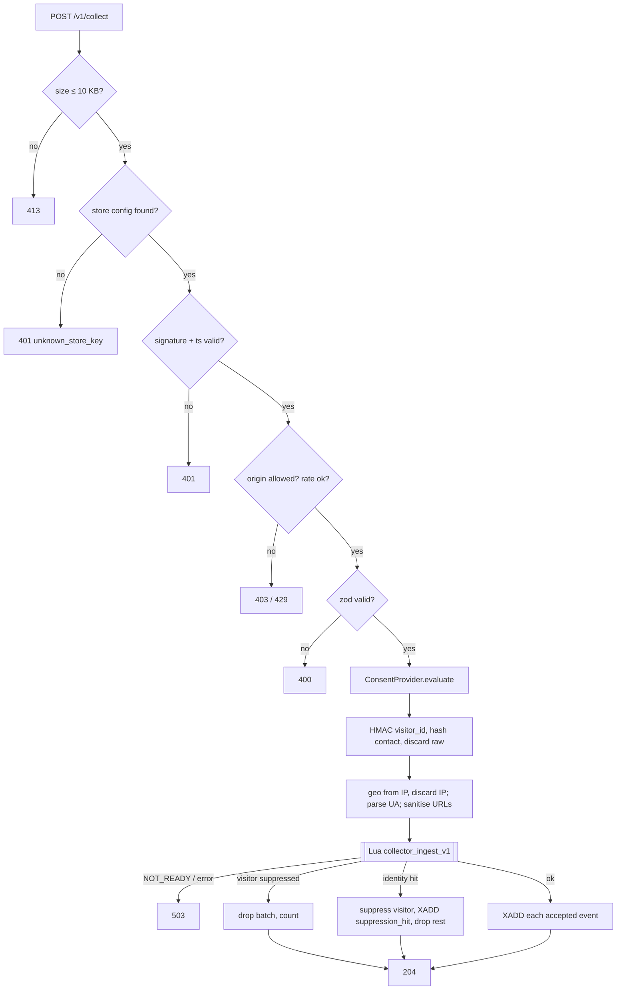

# LLD — Collector (`apps/collector`)

> Names (stream, keys, event names) are defined in [HLD §8](../HLD.md#8-cross-cutting-concepts) and used here verbatim. Hashing, consent evaluation, URL sanitising and suppression come from `packages/privacy` ([privacy-dpdp.md](privacy-dpdp.md)).

## 1. Purpose & scope

`POST /v1/collect` receives consent-gated pixel events and does five things, in order: authenticates the request, validates it, applies consent and suppression, hashes and minimises the data, and appends it to `stream:events-raw`. Its response is quick: `204` means the event was durably accepted or deliberately dropped.

**In scope**
- Request contract and validation, authentication, origin check, rate limiting, size limit.
- Consent evaluation (`ConsentProvider`), suppression checks, `suppression_hit` emission.
- PII handling: phone/email hashing, IP → geo then discard, UA parsing, URL sanitising.
- Drop counters (`stats:collector:*`), health and readiness endpoints.

**Non-goals**
- Pixel implementation — the Web Pixel extension, visitor-id storage, batching and retries are in [shopify-integration.md](shopify-integration.md). This LLD only defines the contract the pixel must meet.
- Sessionisation, channel classification, ClickHouse writes, `consent_records` writes — [event-pipeline.md](event-pipeline.md).
- Any Postgres access. The Collector depends only on durable Redis (HLD §5).

## 2. Interfaces

### 2.1 Endpoints

| Method & path | Purpose |
|---|---|
| `POST /v1/collect?k=<store_key>&ts=<unix_seconds>&kid=<key_id>&sig=<hex>` | Ingest a batch |
| `OPTIONS /v1/collect` | CORS preflight (should be rare — see §2.2) |
| `GET /healthz` | Liveness: process up |
| `GET /readyz` | Readiness: durable Redis reachable **and** `suppress:ready` present **and** geo DB loaded |

**Why query parameters rather than a signature header (accepted; SPEC v0.2 §7.2 updated).** Custom headers force a CORS preflight on every cross-origin request, which adds a round-trip and fails more often on mobile networks. `browser.sendBeacon` cannot set headers, and it is **deprecated** in the pixel browser API ([Shopify browser API](https://shopify.dev/docs/api/web-pixels-api/standard-api/browser); confirmed in the VERIFY results). The pixel therefore sends with `fetch(url, { method: 'POST', body, keepalive: true })`. The body is sent as `Content-Type: text/plain;charset=UTF-8`, which is a CORS "simple request", so no preflight is needed. `application/json` is also accepted.

### 2.2 Request body (zod, `packages/shared/collector.ts`)

```ts
import { z } from 'zod';

const uuidV7 = z.string().regex(/^[0-9a-f]{8}-[0-9a-f]{4}-7[0-9a-f]{3}-[89ab][0-9a-f]{3}-[0-9a-f]{12}$/);
const Money = z.object({ amount_paise: z.number().int().nonnegative().max(10_000_000_000), currency: z.string().length(3) }).strict();
const Contact = z.object({ email: z.string().max(254).optional(), phone: z.string().max(32).optional() }).strict();

const Base = {
  event_id: z.string().uuid(),
  occurred_at: z.string().datetime({ offset: true }),
  page_url: z.string().url().max(2048),
  referrer: z.string().max(2048).default(''),
};

export const PixelEvent = z.discriminatedUnion('event_name', [
  z.object({ event_name: z.literal('page_viewed'), ...Base }).strict(),
  z.object({ event_name: z.literal('product_viewed'), ...Base,
    properties: z.object({ product_id: z.string().max(64), variant_id: z.string().max(64), price: Money }).strict() }).strict(),
  z.object({ event_name: z.literal('product_added_to_cart'), ...Base,
    properties: z.object({ product_id: z.string().max(64), variant_id: z.string().max(64),
      quantity: z.number().int().positive().max(999), line_total: Money }).strict() }).strict(),
  z.object({ event_name: z.literal('checkout_started'), ...Base,
    properties: z.object({ checkout_token: z.string().max(64), total: Money }).strict() }).strict(),
  z.object({ event_name: z.literal('checkout_contact_info_submitted'), ...Base,
    properties: z.object({ checkout_token: z.string().max(64) }).strict(), contact: Contact }).strict(),
  z.object({ event_name: z.literal('checkout_completed'), ...Base,
    properties: z.object({ checkout_token: z.string().max(64), order_id: z.string().max(64), total: Money }).strict(),
    contact: Contact }).strict(),
  z.object({ event_name: z.literal('consent_granted'), ...Base,
    trigger: z.enum(['interaction', 'initial_state', 'refresh']) }).strict(),   // SPEC v0.6: interaction = visitorConsentCollected fired
                                                                                 // initial_state = read from init.customerPrivacy at load
  z.object({ event_name: z.literal('consent_withdrawn'), ...Base }).strict(),
]);

export const CollectBatch = z.object({
  v: z.literal(1),
  visitor_id: uuidV7,
  visitor_new: z.boolean(),        // SPEC v0.6: true only on the batch in which the pixel created visitor_id (default-on signal)
  sent_at: z.string().datetime({ offset: true }),
  consent: z.object({
    analytics: z.boolean(),        // init.customerPrivacy.analyticsProcessingAllowed (or latest visitorConsentCollected)
    marketing: z.boolean(),        // marketingAllowed
    notice_version: z.string().min(1).max(32),
  }).strict(),
  click: z.object({ fbp: z.string().max(128).optional(), fbc: z.string().max(256).optional() }).strict().optional(),
  events: z.array(PixelEvent).min(1).max(25),
}).strict();
export type CollectBatch = z.infer<typeof CollectBatch>;
```

Pixel-side rules the Collector relies on:
- **Money**: Shopify gives decimal amounts (MoneyV2). The pixel sends `Math.round(amount * 100)`.
- **Phone**: `contact.phone` = `checkout.phone ?? checkout.shippingAddress.phone`. COD checkouts collect the shipping phone ([checkout_completed event](https://shopify.dev/docs/api/web-pixels-api/standard-events/checkout_completed)). These are protected customer data fields: they need **Level 2** approval for email, phone and address in production. Without it they arrive as `null` ([protected customer data](https://shopify.dev/docs/apps/launch/protected-customer-data)). The request is in M0-7 (SPEC v0.3).
- **`.strict()` everywhere**: unknown keys are rejected, so no free-form property can carry PII into `events.properties`.
- **`fbp` / `fbc`**: read in the pixel with `await browser.cookie.get('_fbp')` / `browser.cookie.get('_fbc')` (async; confirmed). They are sent in `click` only when marketing consent is granted; otherwise `click` is omitted.
- **Late consent: events are replayed.** "In regions where customers must consent to tracking, app extension callbacks are executed only after consent is given. All previously-registered events are then replayed, to capture any events that already occurred on the page" ([Shopify: pixels — Requesting consent](https://shopify.dev/docs/apps/build/marketing/pixels)). Consequences:
  - The pixel's first callback run happens *after* consent. So `visitor_id` generation and the first `consent_granted` event come first, then the replayed events (for example the landing `page_viewed`) with their original `occurred_at`.
  - **Landing UTMs and click ids survive late consent.** The replayed landing event carries the original `page_url` (with `utm_*`/`fbclid`/`gclid`), so the session's touchpoint is classified correctly ([event-pipeline.md §4.2](event-pipeline.md#42-sessionisation-session_assign_v1-lua-atomic-per-visitor)).
  - Replayed events are sent with the now-granted consent flags. Their `occurred_at` is slightly before the consent record's `occurred_at`. The Collector accepts this, because the processing starts after consent. The 24 h `stale_event` bound is far larger than any replay delay.
  - Which event types Shopify replays is not documented; this is on the dev-store test list (Open question 3).
- **`checkout_completed` is not guaranteed.** Shopify fires it once per checkout on the Thank-you page, or on the first upsell page when post-purchase upsells exist. **If that page fails to load, it isn't fired at all** ([checkout_completed](https://shopify.dev/docs/api/web-pixels-api/standard-events/checkout_completed)). Checkouts that bypass Shopify checkout (third-party checkouts, out of scope per SPEC §2) produce no checkout events. Stitching doesn't depend on this event alone: `checkout_contact_info_submitted` still links the visitor to the phone/email HMAC, and identity-stitching's HMAC and UTM fallbacks cover the rest ([identity-stitching.md §4.2](identity-stitching.md#42-order-side--stitchorder)).

### 2.3 Responses

All bodies are `{"error":"<code>"}` or empty. The pixel ignores them; they exist for debugging and tests.

| Status | Code | When |
|---|---|---|
| `204` | — | Batch accepted, or some or all of it deliberately dropped (consent, suppression, inactive store, stale). A drop is never reported as an error, so the response does not reveal consent or suppression state. |
| `400` | `invalid_payload` | zod failure or unparseable JSON |
| `401` | `unknown_store_key` / `invalid_signature` / `stale_signature` | no config for `k`; HMAC mismatch; `|now − ts| > 300 s` |
| `403` | `origin_not_allowed` | `Origin` present and not in `allowedOrigins` |
| `413` | `payload_too_large` | body > 10,240 bytes (SPEC §7.2) |
| `429` | `rate_limited` | §7 limits |
| `503` | `suppression_unavailable` | `suppress:ready` absent (HLD §8, fail closed) |
| `503` | `stream_unavailable` | durable Redis unreachable or the script fails |

### 2.4 Output — stream entry (`packages/shared/stream.ts`)

One `XADD` per accepted event. Field `payload` holds this JSON; field `store_id` duplicates it for cheap filtering (for example, the erasure scan).

```ts
export type StreamEventEntry = {
  kind: 'event';
  store_id: string; event_id: string; event_name: PixelEventName;
  occurred_at: string; received_at: string;           // ISO-8601, ms precision
  visitor_id: string;
  visitor_new: boolean;                               // from the batch (SPEC v0.6)
  consent_trigger?: 'interaction' | 'initial_state' | 'refresh';   // consent_granted only
  notice_version?: string;                            // consent_* events only (M1-6b): consent_records needs it (P-4)
  page_url: string; referrer: string;                 // sanitised (§4 step 9)
  fbp?: string; fbc?: string;
  device_type: 'mobile' | 'tablet' | 'desktop' | 'unknown';
  os: string; browser: string; is_in_app_browser: 0 | 1;
  geo_state: string; geo_city: string;                 // '' when unknown
  consent_purposes: Purpose[];
  identity: { phone_hmac?: string; email_hmac?: string; identity_hash_hmac?: string };  // never raw
  properties: Record<string, string | number>;         // the event's allowlisted properties, paise amounts
};

export type StreamSuppressionHit = {
  kind: 'suppression_hit';
  store_id: string; visitor_id: string; identity_hash_hmac: string; received_at: string;
};
```

### 2.5 Store config — read from `collector:store:<store_key>`

```ts
export const CollectorStoreConfig = z.object({
  storeId: z.string().uuid(),
  status: z.enum(['active', 'inactive']),    // 'active' only with DPA accepted AND India opt-in confirmed (privacy-dpdp §4.10)
  inactiveReason: z.enum(['dpa_missing', 'consent_region_unconfirmed', 'consent_default_on_detected',
    'consent_policy_not_required', 'uninstalled', 'org_deletion']).nullable(),
  allowedOrigins: z.array(z.string().url()).max(20),
  signingKeys: z.array(z.object({ kid: z.string().max(16), secret: z.string().min(32) })).min(1).max(2),
  childDirected: z.boolean(),
  noticeVersion: z.string(),
}).strict();
```

Core API writes this on install, settings change and key rotation; the suppression rebuild republishes it (HLD §8). The Collector caches it in process, keyed by `store_key`, for 30 s. It also caches misses for 30 s, so floods of unknown keys don't reach Redis.

## 3. Data owned

| Item | Access | Notes |
|---|---|---|
| `stream:events-raw` | write (`XADD … MAXLEN ~ 2000000`) | Entries per §2.4 |
| `suppress:<store_id>:erased:visitor`, `…:erased:identity`, `…:withdrawn:visitor` | read; `ZADD` to `erased:visitor` on an identity hit | HLD §8 |
| `suppress:ready` | read | HLD §8 |
| `collector:store:<store_key>` | read | HLD §8 |
| `stats:collector:<store_id>:<yyyymmdd>` | `HINCRBY`, `EXPIRE` 100 days | reasons in §4 step 10 |

No Postgres or ClickHouse access. No tables, keys or queues beyond HLD §8.

## 4. Processing flow

1. **Size and parse.** The Fastify `bodyLimit` of 10,240 bytes → `413`. Parse `text/plain` or `application/json` as JSON → `400` on failure.
2. **Store config.** Look up `k` in the cache, then `GET collector:store:<k>`. Missing → `401 unknown_store_key`.
3. **Signature.** `ts` must be within ±300 s of now. Compute `HMAC-SHA256(secret[kid], "${ts}.${rawBody}")` and compare in constant time → `401` on mismatch. Two `kid`s are accepted during rotation.
4. **Origin and page plausibility.** The strict pixel sandbox sends **`Origin: null`** (resolved in the VERIFY results), so the header can't identify the shop.
   - `Origin` absent or `null` → continue.
   - `Origin` present and not in `allowedOrigins` → `403 origin_not_allowed`. This catches requests from ordinary third-party web pages.
   - Every event's `page_url` host must be one of the store's hosts (`allowedOrigins` = the myshopify domain plus custom domains, refreshed by the Shopify reconcile). Other events are dropped with reason `foreign_page` (still `204`).
   - Because the Origin check is weak, the signature, per-IP and per-store rate limits, strict schemas and the page-host check together carry the anti-abuse load (§6).
5. **Rate limit** (§7) → `429`.
6. **Validate** `CollectBatch` → `400`.
7. **Consent.** A store config with `status='inactive'` (including `inactiveReason = consent_region_unconfirmed | consent_default_on_detected | consent_policy_not_required`) → drop everything with reason `store_inactive`, before any processing. Then `decision = ConsentProvider.evaluate({analytics, marketing, noticeVersion}, {childDirected})`. For non-consent events, `decision.canStore = false` → drop with reason `no_analytics_consent`. `consent_*` events are always forwarded, carrying `decision.purposes`. Store `status='inactive'` → drop everything with reason `store_inactive`.
8. **Hash.** `visitorHmac = hmac(store, visitor_id)`. For events with `contact`, run `hashContact` on it; the raw strings are dropped from memory as soon as the call returns and are never logged. Unnormalisable contacts are silently omitted.
9. **Minimise.**
   - The client IP comes from `X-Forwarded-For`, trusting exactly one proxy hop (the ALB). It is looked up in the geo DB for `geo_state`/`geo_city`, then discarded; it never enters the stream.
   - The UA is parsed to `device_type`/`os`/`browser`. `is_in_app_browser = 1` when the UA contains `FBAN`, `FBAV`, `Instagram`, `Line/`, `Snapchat` or `wv)` (Android WebView).
   - `sanitiseUrl` runs on `page_url` and `referrer`. It keeps scheme, host and path, plus only the query params `utm_source`, `utm_medium`, `utm_campaign`, `utm_content`, `utm_term`, `fbclid`, `gclid`, `gbraid`, `wbraid`. It masks path segments after `/checkouts/`, `/orders/`, `/account/` and `/cart/c/` as `:token`, and drops the fragment. For `referrer` it keeps origin and path only.
   - Clock: events with `occurred_at < now − 24 h` are dropped (`stale_event`); `occurred_at > now + 5 min` is clamped to `received_at`.
10. **Suppression + append (one Redis round trip).** `EVALSHA collector_ingest_v1` runs a Lua script:
    - If `suppress:ready` is missing → return `NOT_READY` (→ `503 suppression_unavailable`).
    - `ZSCORE suppress:<s>:erased:visitor visitorHmac`. For non-consent events, also check `ZSCORE suppress:<s>:withdrawn:visitor visitorHmac`. A score > now → drop the whole batch (`suppressed_visitor`).
    - For each event with `identity_hash_hmac`: `ZSCORE suppress:<s>:erased:identity h`. On a hit, drop that event and every later event in the batch (`suppressed_identity`). Then `ZADD suppress:<s>:erased:visitor <now + 13 months> visitorHmac` and `XADD stream:events-raw MAXLEN ~ 2000000 * kind suppression_hit …`.
    - `XADD stream:events-raw MAXLEN ~ 2000000 * store_id <s> payload <json>` for each accepted event.
    - `HINCRBY stats:collector:<s>:<yyyymmdd> <reason> <n>` for each drop reason, then `EXPIRE 8640000`. Reasons: `no_analytics_consent`, `suppressed_visitor`, `suppressed_identity`, `store_inactive`, `stale_event`, `foreign_page`.
11. **Respond** `204`, or `503` if the script returned `NOT_READY` or errored.

The earlier batch events of a device that is newly identified as erased are *not* stored: once the identity hit is found, the whole remaining batch is dropped. Events the device sent in earlier requests are purged by the follow-up `DsrJob` (HLD §6a/§6d).



### 4.1 M1-5 implementation notes (deliberate refinements of the text above)

- **Stream fields.** Both entry kinds are stored as two fields, `store_id` and `payload` (JSON), so a consumer parses every entry the same way. §2.4 left `suppression_hit`'s fields loose; this settles them (`packages/shared/src/stream.ts`).
- **Per-IP limit runs first** (before the store lookup), not at step 5: it needs nothing from the request, so it is the cheapest way to shed a flood. The per-store limit is charged **in events** after validation, because the count isn't known earlier.
- **An identity hit drops the whole batch, earlier events included.** Step 10's "the whole remaining batch" is read strictly: nothing from a device newly identified as erased is stored, so the follow-up purge has less to do.
- **An `inactive` store** still goes through the script (with no events), so its drop counters are written and the fail-closed rule applies — a store going inactive can't mask an unready suppression set.
- **The client IP** is Fastify's `request.ip` with `trustProxy` written as "trust hop 0 only" (the ALB): the right-most `X-Forwarded-For` entry. Fastify's types don't accept the hop-count number proxy-addr does.
- **Geo is not built.** DB-IP Lite is approved (SPEC §3) but reading its `.mmdb` needs a reader library that isn't on the approved list; `geo_state`/`geo_city` are `''` (the value a lookup miss gives) behind the `GeoLookup` interface in `apps/collector/src/geo.ts`.
- **`ua-parser-js` 1.x** ships no types and `@types/ua-parser-js` isn't approved, so `apps/collector/src/types/ua-parser-js.d.ts` declares the part used.
- **Test seam.** `CollectDeps.redisKeys` overrides the two global Redis names (`suppress:ready`, `stream:events-raw`); production never sets it. Tests use it so they can't write to, or delete the readiness marker of, a developer's live local pipeline.

## 5. Failure modes

| Failure | Behaviour | Retry / idempotency |
|---|---|---|
| Durable Redis unreachable | `503 stream_unavailable`; `/readyz` fails; alert on the 5xx rate | The pixel does not retry on 5xx, so events sent during the outage are lost (HLD Q2) |
| `suppress:ready` missing | `503 suppression_unavailable` on every request; `/readyz` fails; alert `suppression_unavailable` after 60 s | Recovers automatically after the rebuild |
| Script not cached (`NOSCRIPT`) | `SCRIPT LOAD`, then retry once | — |
| Duplicate submission (pixel retry, double fire) | Both `XADD`ed | `event_id` is deduped downstream (ADR-0017) |
| Geo DB missing or corrupt at boot | Startup fails; `/readyz` false | — |
| Geo lookup miss | `geo_state`/`geo_city = ''` | — |
| UA unparseable | `device_type='unknown'`, `os=''`, `browser=''` | — |
| Store config stale (up to 30 s after a change) | Old config used briefly. An `inactive` → `active` change takes ≤ 30 s. `active` → `inactive` (e.g. DPA withdrawn) has the same bound | Documented bound |
| Master identity secret unavailable | Startup fails | — |
| Stream near `MAXLEN` because consumers are stalled | Trimming would drop unprocessed entries, so it is **data loss**. Alert when `XLEN > 1,500,000` or consumer lag > 5 min ([event-pipeline.md](event-pipeline.md)) | Sizing in §7 |

The Collector has no dead-letter path. It either appends to the stream, drops with a counted reason, or returns an error.

## 6. Privacy touchpoints

| ID | Where |
|---|---|
| P-1 (default-on regions, SPEC v0.6) | Where Shopify treats tracking as on by default, "analytics allowed" can mean no shopper action. Covered by the onboarding gate (the store stays `inactive` until India opt-in is confirmed) and by the runtime default-on signal (`visitor_new` + `trigger`), which can auto-pause the store (HLD §8 *Consent-region gate*). |
| P-1 | Step 7: nothing is stored without analytics consent. The pixel is also not loaded by Shopify without it (`customer_privacy.analytics = true`, marketing not required — [Shopify pixel privacy](https://shopify.dev/docs/api/web-pixels-api/pixel-privacy)). |
| P-3 | `consent_withdrawn` is forwarded regardless of flags. The withdrawn-set check drops later events. |
| P-4 | `consent_*` events carry purposes and notice version into the stream; `event-workers` writes `consent_records`. |
| P-5 | `consent_purposes` stamped on every entry. |
| P-6 | `childDirected` strips `ad_platform_measurement` in step 7. |
| §5.4 identifiers | Step 8: raw phone/email exist only inside `hashContact`. No SHA-256 is produced here. |
| §5.4 IP | Used only for geo, never forwarded or stored. CAPI does not receive `client_ip_address` (accepted; SPEC v0.2 §5.4). |
| Infra logs | The Collector's ALB has access logs disabled ([privacy-dpdp.md §4.11](privacy-dpdp.md#411-infrastructure-logs)). |
| §5.4 UA | Parsed at ingest into `device_type`/`os`/`browser`/`is_in_app_browser`; **the raw UA is discarded and never stored** (SPEC v0.5), at least until the Meta optimisation test result is known (meta-integration §4.7). |
| §5.4 logs | Request logs include `store_id`, status, reason and latency only. Body, query string (`sig`), `visitor_id`, IP and UA are never logged. The pino redaction hook is a second line of defence. |
| Erasure | Suppression checks (step 10) and `suppression_hit` for new devices. |
| S-1 | TLS 1.2+ at the ALB; `Strict-Transport-Security: max-age=31536000; includeSubDomains` on every response. |
| S-6 | Master identity secret from Secrets Manager. Pixel signing keys rotate through `signingKeys` (two active). |

**What the signature is worth.** The signing secret is delivered to the pixel in its settings, so any shopper's browser can read it. The signature stops casual forgery and replay beyond 5 minutes; it does not authenticate the sender. The real protections against injected fake events are the page-host check (the Origin header is `null` from the sandbox), rate limits, strict schemas, and the fact that attribution needs orders confirmed by HMAC-verified Shopify webhooks. A forged `checkout_completed` cannot create revenue.

## 7. Performance & limits

| Item | Value |
|---|---|
| Latency | p95 < 50 ms, p99 < 150 ms (SPEC §7.2) |
| Budget | parse + zod ~1 ms; hashing < 0.1 ms; geo < 0.1 ms; UA < 0.5 ms; Lua round trip ~1–3 ms in-VPC |
| Throughput target | 500 events/s sustained (SPEC M4-6). At ~5 events/request this is ~100 req/s |
| Payload | ≤ 10,240 bytes, ≤ 25 events per batch |
| Rate limit per client IP (in-process token bucket, per task) | 30 req/s, burst 60. Kept generous because Indian mobile carriers put many shoppers behind shared CGNAT addresses (**VERIFY** in the load test) |
| Rate limit per store (in-process, per task) | 500 events/s, burst 1,500 (**VERIFY**). Effective limit = per-task limit × running tasks; no shared Redis limiter, to keep one round trip per request |
| Stream cap | `MAXLEN ~ 2,000,000`: ~11 h at 50 events/s average, ~1.1 h at 500 events/s. At ~800 bytes/entry that is ~1.6 GB (**VERIFY** the entry size and the node memory headroom) |
| Tasks | Fargate, 0.5 vCPU / 1 GB, min 2 (across AZs), autoscale on CPU 60% or p95 > 40 ms |
| CORS | `Access-Control-Allow-Origin: *` (the request's Origin is `null`); no credentials; `Access-Control-Max-Age: 86400`; the Collector sets no cookies. The pixel never reads the response body. |

## 8. Test plan

**Unit**
- Every zod branch, including rejection of unknown keys (the PII-smuggling guard).
- Signature: valid, wrong `kid`, skew ±301 s, constant-time path.
- `sanitiseUrl` fixtures.
- UA → in-app-browser table (Instagram, Facebook, generic WebView, Chrome, Safari).
- Money bounds.

**Integration** (Fastify `inject` + Redis testcontainer + a Lua script test)
- Consented batch → N stream entries, and none contain a raw email or phone (regex over `XRANGE`).
- `analytics:false` → `204`, zero entries, `stats:collector` incremented.
- `consent_withdrawn` with `analytics:false` → forwarded.
- Visitor in the withdrawn set: `page_viewed` dropped, `consent_granted` forwarded.
- Visitor in the erased set: everything dropped, including `consent_granted`.
- Identity hit → `suppression_hit` entry, visitor added to the erased set, later events in the batch dropped.
- `suppress:ready` deleted → `503`, `/readyz` false.
- Inactive store → all dropped.
- 10,241-byte body → `413`.

**Load** (k6, staging): 500 events/s for 30 min → p95 < 50 ms, zero 5xx, stream lag flat.

**§5.10 compliance tests supported**
- Test 1 (unconsented dropped, counter incremented, nothing stored): primary owner.
- Test 2 (withdrawal): Collector half.
- Test 3 (no raw PII in ClickHouse): guaranteed at the stream boundary.
- Test 4 (no PII in logs): log-scan over the integration run.

## 9. Open questions

**Resolved in batch-1 review**
- Query-string signature accepted.
- No IP for CAPI accepted.
- Libraries approved: **DB-IP Lite** for geo (CC BY 4.0; the attribution "IP geolocation by DB-IP" with a link to db-ip.com appears in the dashboard footer and in the docs) and **`ua-parser-js` pinned to `^1`** (MIT; v2 is AGPL, so a renovate rule blocks major bumps).

**Open**
1. **DB-IP Lite accuracy.** Its city-level accuracy for Indian mobile IPs is unknown; check against a sample before relying on `geo_city` in the RTO-by-geo views (**VERIFY**). The monthly database update is pulled into the Collector image at build time.
2. **`keepalive` in the strict sandbox.** `Origin: null` and the `sendBeacon` deprecation are resolved. Whether `fetch(…, { keepalive: true })` survives page unload from the pixel's sandbox is not documented; test it in a dev store (it affects loss of the last batch on navigation).
3. **Dev-store consent tests** (both together):
   - (a) **Replay**: land with UTMs, delay consent by ~20 s, grant → confirm that the replayed events arrive, which types they are, that the `occurred_at` values are original, and that the landing `page_url` still carries its UTMs.
   - (b) **Withdrawal**: does Shopify still deliver `visitorConsentCollected` to the pixel after analytics consent is withdrawn (below)?
   - (c) **Default-on region** (SPEC v0.6), from a **fresh browser profile with an Indian IP** (VPN or an ap-south-1 test host):
     - *before* configuring India as opt-in: expect the pixel to run with `analyticsProcessingAllowed = true` and no banner interaction, with `consent_granted.trigger = 'initial_state'` on a `visitor_new` batch;
     - *after* configuring opt-in: expect nothing until the banner is accepted, then `trigger = 'interaction'`. Confirm whether `visitorConsentCollected` reaches the late-loading pixel at all.
     - The result decides whether the runtime default-on signal is enforceable (HLD §8 *Consent-region gate*). Also record the exact Shopify admin labels for the onboarding guide, and whether `consentPolicy(countryCode: IN)` reflects the change (and which scope it needs).

   Withdrawal detail — **Does Shopify still deliver `visitorConsentCollected` to the pixel after analytics consent is withdrawn**, given that pixels with required analytics consent aren't loaded without it? If not, `consent_withdrawn` may never reach us. Future events still stop (the pixel is unloaded), but two things would then fail silently: the withdrawal-triggered erasure (privacy-dpdp §4.5), and CAPI for earlier orders, which would rely on a stale `granted` record. **VERIFY**. Fallbacks if it isn't delivered:
   - (a) CAPI requires a `granted` record newer than 30 days (the refresh interval);
   - (b) a visitor with no consent refresh for 45 days is treated as withdrawn, and a withdrawal-triggered erasure is enqueued by the `retention` job.
4. **Rate-limit numbers** (§7) are placeholders until the load test.
