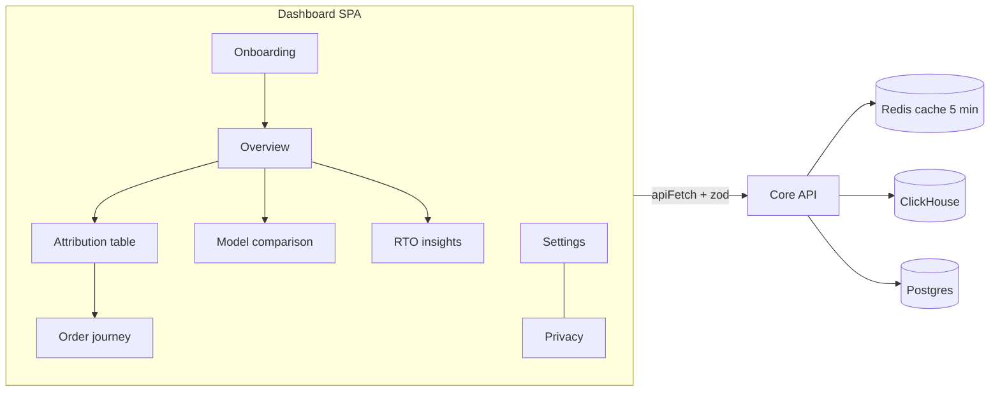

# LLD — Dashboard (`apps/dashboard`)

> React + Vite + TypeScript, **TanStack Router**, TanStack Query, TanStack Table, Recharts, Tailwind (SPEC v0.5 §3). Screens are SPEC §11. Data comes only from Core API endpoints defined in [reporting-api.md](reporting-api.md), [auth-tenancy.md](auth-tenancy.md), [privacy-dpdp.md](privacy-dpdp.md) and the integration LLDs. Names follow [HLD §8](../HLD.md#8-cross-cutting-concepts).

## 1. Purpose & scope

The merchant-facing SPA:
1. onboarding wizard;
2. overview;
3. attribution table;
4. model comparison;
5. order journeys;
6. RTO insights;
7. settings;
8. privacy;

plus app-wide concerns: INR/IST formatting, empty states, permission-aware UI, the breach banner, data-freshness banners, and the DB-IP attribution footer.

**Non-goals**
- The Shopify embedded app UI (a minimal status page in `apps/shopify-app`, shopify-integration §4.1).
- Any computation of metrics in the browser. The API returns final numbers; the client only formats them.
- Mobile-native apps.
- Localisation beyond English (the Hindi text is in the shopper notice template, not the dashboard).
- Third-party analytics or session replay in the dashboard (§6).

## 2. Interfaces

### 2.1 Routes → endpoints

| Route | Screen | Endpoints | Min role |
|---|---|---|---|
| `/onboarding/*` | 1 | `POST /v1/orgs`, `POST /v1/orgs/:id/dpa/accept`, `GET /v1/integrations/{shopify,meta,google_ads}/connect`, `POST /v1/integrations/shiprocket`, `PUT /v1/integrations/:id/settings`, `GET/PUT /v1/stores/:id/privacy-settings`, `GET /v1/stores/:id/integrations` | owner/admin |
| `/invite/:token` | — | `POST /v1/invites/:token/accept` | invitee (logged in) |
| `/s/:storeId/overview` | 2 | `reports/overview` | viewer |
| `/s/:storeId/attribution` | 3 | `reports/breakdown` (+ `format=csv`) | viewer (CSV: analyst) |
| `/s/:storeId/models` | 4 | `reports/model-comparison` | viewer |
| `/s/:storeId/orders/:orderId` | 5 | `orders/:orderId/journey` | analyst |
| `/s/:storeId/rto` | 6 | `reports/rto` | viewer |
| `/s/:storeId/settings/{attribution,channels,integrations,team}` | 7 | `attribution-settings`, `channel-rules`, `integrations` (+ settings), `orgs/:id/invites` (+ member endpoints, SPEC v0.5) | admin (team: admin/owner) |
| `/s/:storeId/privacy/{overview,requests,retention,notice,subprocessors,audit}` | 8 | `privacy/requests` (+ export), `privacy-settings`, `privacy/consent-stats`, `orgs/:id/audit-log` | admin |

Global: `GET /v1/me` on load (memberships, breach notices); `POST /v1/auth/*`.

### 2.2 Client contracts
- API types and zod schemas are imported from `packages/shared` (SPEC §0 rule 5). Responses are parsed with zod in the query functions, so a contract drift fails loudly.
- One `apiFetch` wrapper:
  - `credentials: 'include'`, JSON only;
  - maps `401` → login; `403 forbidden_role` → an inline "You don't have access" panel; `404` → not found; `503 report_unavailable` → keep stale data and show a banner.
- TanStack Query keys: `[storeId, endpoint, canonicalParams]`; `staleTime: 60 s` for reports (the server caches 5 min); `retry: 2` except on 4xx.

### 2.3 Formatting (`apps/dashboard/src/format.ts`)

| Need | Implementation | Example (verified in Node 24 ICU) |
|---|---|---|
| Money (full) | `Intl.NumberFormat('en-IN', {style:'currency', currency:'INR', maximumFractionDigits:0})` over paise ÷ 100 | `₹12,34,56,789` |
| Money (compact KPI cards) | `…{style:'currency', currency:'INR', notation:'compact'}` | `₹1.3Cr` |
| Numbers (compact) | `{notation:'compact'}` | `1.3L`, `1.3Cr` |
| Dates/times | `Intl.DateTimeFormat('en-IN', {timeZone:'Asia/Kolkata', …})` — always IST (SPEC §11) | `25 Sept 2026, 12:10 am` |
| Ratios | ROAS `2.35×`; percentages 1 decimal | — |
| Paise → rupees | integer ÷ 100 only at format time; never floats in state or computation | — |

Browser ICU data can differ from Node's (older Safari especially), so an E2E check asserts the compact output on the supported browsers. The fallback is a small `formatLakhCrore` helper written without a new dependency.

## 3. Data owned

No persistent data. Browser storage:
- **URL search params** (TanStack Router, typed with zod): **all report filters live in the URL**: `from`, `to`, `model`, `basis`, `level`, `parent`, `platform`, `sort`, `dir`, and the RTO `level`. A view is shareable and bookmarkable, and back/forward work. Route `validateSearch` uses the same zod schemas as the API (`ReportRange`, `BreakdownQuery`, `RtoQuery` in `packages/shared`).
- `localStorage`: UI preferences only (table column visibility, collapsed sidebar, last-used store). **Never** API data, identifiers or tokens. The date range is not stored here; it is in the URL.
- Session: the `tp_session` HttpOnly cookie, unreadable by JS (auth-tenancy §4.1).
- TanStack Query cache in memory only; cleared on logout and on org/store switch.

## 4. Processing flow — screens

### 4.1 Onboarding wizard (SPEC §11.1)
The wizard is resumable. Each step's completion is derived from server state (integration status, DPA, privacy_config), not from local flags.

1. **Create org** → `POST /v1/orgs`.
2. **Accept DPA** (owner): render the DPA version text, then `POST dpa/accept`. Tracking stays inactive until done (privacy-dpdp §4.10).
3. **Install Shopify**: enter `<name>.myshopify.com` → `connect?orgId&shop` → return → the store appears. Shows the scope list, including "protected customer data (email, phone, address) — used only to create one-way fingerprints", and the note "Backfill: 60 days (90 once Shopify approves extended access)" when `read_all_orders` is absent.
4. **Connect Meta**:
   - OAuth → pick ad accounts; non-INR accounts are disabled with the error from meta-integration §4.1;
   - enter the dataset (pixel) id;
   - CAPI toggles: DeliveredPurchase ✓, RTO ✓, Purchase ☐. Checking Purchase opens a modal with the double-count warning, which requires the acknowledgement checkbox (`acknowledge_double_count`);
   - then a short guide: create the "Delivered Purchase" custom conversion in Events Manager.
5. **Connect Google**: OAuth → pick accounts (same INR rule).
6. **Connect Shiprocket**: API-user email/password form (with a link to Shiprocket's API-user setup) → show the **webhook URL `https://api.<domain>/webhooks/lp/<token>`** once, with a copy button and the warning "shown once — you can rotate it later".
7. **UTM templates**: copy-paste templates from [event-pipeline.md §4.3](event-pipeline.md#43-channel-classification) (Meta `{{campaign.id}}`…, Google `{campaignid}`…). A "UTM health" preview appears after traffic: the share of paid sessions with numeric campaign ids.
8. **Consent and notice checklist — tracking stays disabled until this step is complete** (SPEC v0.6 tracking gate):
   - download the shopper-notice template (EN/HI, from `docs/dpdp`, served as a static asset);
   - enter the grievance contact;
   - tick "notice published" and "banner live" (writes `privacy_config.checklist`);
   - **Set India to opt-in** — a step-by-step panel mirroring [docs/dpdp/README.md § Setting India to opt-in](../../dpdp/README.md#setting-india-to-opt-in-required-before-tracking-starts):
     1. Shopify admin → **Settings → Customer privacy → Cookie banner → Regions and content** → **Edit** in *Regions* → include the region covering India, so the banner is shown and consent is required.
     2. If India can't be selected there, install a consent app that writes to Shopify's Customer Privacy API and configure India as opt-in.
     3. Verify in an incognito window from India: no TruePath events arrive until you accept analytics cookies.

     The exact admin labels are confirmed in the dev-store test. Then tick **"India requires opt-in in my consent banner"** (sets `india_opt_in_confirmed_at`; audited).
   - If the `consentPolicy` check is available and reports that consent isn't required for India, the step shows a blocking error instead of the tick box.
   - Explanation: "TruePath only tracks shoppers who accept analytics cookies in your banner. In India, Shopify may treat tracking as allowed by default unless you set it to opt-in."
9. **Tracking live** (only reachable once step 8 is complete): poll `GET /v1/stores/:id/integrations` every 10 s until Shopify's health shows a recent pixel event (from `Freshness.events_max_received_at`). Shows "First events arriving ✓". After 10 min without events, show troubleshooting (consent banner, pixel installed, test in an incognito window after accepting cookies).

### 4.2 Overview (SPEC §11.2)
- **Controls**: IST date range (presets: 7/30/90 days, this month, Diwali/BBD windows as named presets from a static calendar in `packages/shared`); model selector (default from settings); **Placed / Delivered** toggle.
- **KPI cards**: Spend, Revenue, ROAS, Orders, CPA, RTO %, MER. Delivered revenue shows the **projected pending** amount beside it ("+₹4.2L projected"), with a "low confidence" badge when `pending_projection.low_confidence`.
- **Trend chart** (Recharts line/bar): spend vs revenue per IST day. A footnote renders `notes[]`, for example "Spend dates follow each ad account's timezone".
- **Platform-reported vs TruePath**: per platform, platform ROAS vs our ROAS with delta %. A tooltip explains the Meta windows (`7d_click+1d_view`) and delivered basis.
- **Freshness banner** from `freshness` (e.g. "Meta spend last synced 4 h ago").
- **Empty states**: no Shopify → "Connect your store"; no ad platform → spend cards show "Connect Meta or Google"; orders but no pixel data → "Tracking isn't live yet" with the checklist link.

### 4.3 Attribution table (SPEC §11.3)
- TanStack Table with server-side sort and pagination (cursor).
- Drill down channel → campaign → ad set → ad via `parent`; breadcrumb.
- Columns: spend, orders, revenue, ROAS (placed/delivered per toggle), CPA, RTO %, COD %, platform ROAS, delta. Column-visibility state lives in `localStorage`.
- "Meta — unmapped campaign" rows link to the UTM templates.
- **CSV export** (analyst+): `format=csv` download. The button tooltip says "Exports are recorded in the audit log".

### 4.4 Model comparison (SPEC §11.4)
Same rows, one column group per model (revenue and ROAS), with highlighting of the largest differences across models. The level selector matches the attribution table.

### 4.5 Order journeys (SPEC §11.5)
- Search by Shopify order number/id → `journey`.
- A vertical timeline of touchpoints by device ("Device 1 — Instagram in-app browser, Android"), each with its credits for all 6 models (a small bar per model).
- Order panel: total, refunds, payment method, delivery timeline (Shopify/Shiprocket statuses), CAPI dispatch statuses with plain-language skip reasons (`no_consent_record` → "Shopper didn't consent to ad measurement").
- An `attribution_confidence: low` banner: "Matched from landing-page UTMs only".
- Analyst+ only; a footer note "Viewing journeys is recorded in the audit log". **No visitor ids, hashes or IPs are ever shown** — the API doesn't return them.

### 4.6 RTO insights (SPEC §11.6)
- Tabs: campaign, ad, pincode prefix, device, in-app browser. All five levels are in SPEC v0.5 §10.
- Bar chart of RTO % plus a table with orders, COD share and RTO revenue lost. `low_sample` rows are greyed.

### 4.7 Settings (SPEC §11.7)
- **Attribution defaults**: model, lookback (1–90), basis. Changing lookback shows "Recomputes the last 45 days".
- **Channel rules editor**: an ordered list; each rule is a condition builder whose field, op and value mirror `ChannelRuleMatch`; channel is picked from the HLD §8 slugs, sub-channel is free text. Includes a **test box**: paste a landing URL and referrer to see the resulting channel, via a client-side run of the shared pure `classify()` from `packages/shared`, the same code as the pipeline. Saving → `PUT channel-rules`; the note says rules apply to new visits.
- **Integrations health**: per provider, status, last sync and the health checks from each integration LLD, including:
  - Shopify: unmapped payment gateways with COD/prepaid buttons (`PUT settings`); the "Backfill limited to 60 days" info;
  - Meta: CAPI toggles, the Purchase warning, test-mode code, and skip-reason counts;
  - Google: coverage gap;
  - Shiprocket: webhook active vs polling, unmapped statuses (mapping form), rotate webhook token.
- **Team & roles**: members, invite (email + role; `POST /v1/orgs/:id/invites`, accepted at `/invite/:token` → `POST /v1/invites/:token/accept`), role change and remove (`PUT`/`DELETE /v1/orgs/:id/members/:userId`; last-owner guard).
- **Delete organisation** (owner only): a three-step flow.
  1. Offer the export first: download aggregate reports as CSV.
  2. Type the org name to confirm → `DELETE /v1/orgs/:id`.
  3. Show a banner "Scheduled for deletion on <date + 7 days> — cancel". During the 7-day grace period the owner can cancel. After it, all data is deleted within 30 days (auth-tenancy §4.6).
- **Integrations health — Shopify** also shows **pixel coverage** over the last 7 days (orders matched to a pixel journey ÷ all orders; < 50% warn, < 25% error), with troubleshooting tips such as consent banner coverage or a missing pixel.

### 4.8 Privacy (SPEC §11.8)
- **Consent-region health** (SPEC v0.6), from `privacy_config.consent_health` (returned with `privacy-settings`):
  - **warn** banner: "Many new visitors were tracked without clicking your consent banner — India may not be set to opt-in", with a link to the step-8 guide;
  - **paused** state: a red, non-dismissible banner app-wide, "Tracking paused: consent banner not requiring opt-in". Offers "I've fixed it — re-confirm" (re-runs the step-8 tick) and, once counsel approves the remediation, "Erase data collected without opt-in" (privacy-dpdp §4.13).
- **Consent & coverage** (`GET privacy/consent-stats`, SPEC v0.5): **pixel coverage** (orders with a pixel match ÷ all orders, with a weekly trend), **dropped-event counts** by reason (daily), and **withdrawals per week** (with completed withdrawal erasures). There is no "consent rate": it can't be measured, because the pixel doesn't load without consent.
- **Privacy requests**:
  - create form (type; phone or email). The input is sent once, never stored client-side, and cleared after submit;
  - list with status, SLA countdown (`due_at`), trigger filter (merchant / Shopify / consent withdrawal), and export download (`302` → presigned URL, audited);
  - erasure confirmation copy: "Hidden immediately, purged within 7 days, removed from backups within 30 days".
- **Retention settings**: months (3–25) with an irreversible-deletion warning; child-directed toggle ("disables ad-platform sharing").
- **Notice template download** and **sub-processor list** (rendered from `docs/dpdp/subprocessors.md`, bundled at build time).
- **Audit log**: a filterable table (`GET /v1/orgs/:id/audit-log`); viewing it is audited (`audit_log_viewed`).

### 4.9 App-wide
- **Breach banner**: `GET /v1/me` → `breach_notices[]` → a non-dismissible banner until the incident is closed.
- **Footer**: "IP geolocation by [DB-IP](https://db-ip.com)" (CC BY 4.0 attribution, SPEC v0.2).
- **Store switcher** for agencies (multiple orgs/stores); switching clears the query cache.

## 5. Failure modes

| Failure | UX |
|---|---|
| `503 report_unavailable` | keep the last data, banner "Reports are temporarily unavailable — retrying", auto-retry via TanStack Query |
| Stale sources (`freshness`) | per-source banner; never silent |
| `401` | redirect to login, keeping the intended route |
| `403 forbidden_role` | inline explanation naming the required role |
| OAuth callback error | the wizard step shows the provider's error code and a retry button |
| zod parse failure on a response | error boundary "Something went wrong" + Sentry event (PII-scrubbed); no partial render of wrong numbers |
| Invalid channel rule | inline validation from the shared zod schema before submit |

## 6. Privacy touchpoints

| ID | How |
|---|---|
| §5.4 "no PII in analytics tools" | **No** third-party analytics, tag managers, heatmaps or session replay in the dashboard. Sentry browser SDK (SaaS, **EU region**, SPEC v0.5) with `sendDefaultPii: false`, **no replay**; `beforeSend` strips query strings, form values and identifiers; breadcrumbs exclude input values and request bodies. |
| DSR input | Phone/email entered on the Privacy page goes straight to the API over TLS and is never stored in state after submit, `localStorage` or logs. |
| S-3 | UI hides actions the role can't perform; the API enforces the same matrix (auth-tenancy §2.3). The UI is not the control. |
| S-4 | Copy tells users when an action is audited (exports, journey views, audit-log views). |
| Journeys | device labels only; no identifiers (reporting-api §4.4). |
| P-2 | The onboarding checklist and notice download support the merchant's notice obligation. |
| S-1 | HSTS; a CSP of `default-src 'self'`; `connect-src` to the API origin and Sentry only; `frame-ancestors 'none'`. |

## 7. Performance & limits

| Item | Target |
|---|---|
| Initial JS | ≤ 250 KB gzip (route-level code splitting; Recharts only on chart routes) |
| Overview interactive | < 2.5 s on a mid-range Android over 4G (most Indian merchant users are on mobile) |
| Table | server-paginated; ≤ 500 rows client-side |
| Polling | only the onboarding "tracking live" step (10 s); reports refetch on focus plus 5 min |

## 8. Test plan

**Unit** (Vitest)
- Formatting (INR full and compact, lakh/crore, IST dates across midnight UTC).
- Permission-gated rendering per role.
- The channel-rule builder ↔ `ChannelRuleMatch` round trip.
- Paise-only arithmetic helpers.

**E2E** (Playwright, SPEC §14), on the seeded synthetic store (55% COD, 25% RTO on COD, 70% mobile, 40% in-app browser):
- the onboarding happy path with mocked OAuth providers, including the Purchase warning acknowledgement;
- overview numbers match the reporting-api golden fixtures;
- delivered/placed toggle; drill-down to ad level; CSV download (audit row asserted via the API);
- journey view as analyst (allowed) and viewer (blocked);
- privacy request create → status → export;
- compact INR formatting asserted in Chromium, WebKit and Firefox.

**Accessibility**: axe checks on each route (no critical violations).

**§5.10 compliance tests supported**
- Test 4 (no PII in logs): the Sentry scrubbing test.
- Test 8 (audit): E2E asserts audit rows for exports, journey views and settings changes.

## 9. Open questions
1. *(resolved: TanStack Router, with typed search params holding the report filters — SPEC v0.5 §3.)*
2. *(resolved: consent stats, RTO levels, invite accept, member management and org deletion endpoints approved — SPEC v0.5 §10.)*
3. **Sale-calendar presets** (Diwali, BBD, EOSS dates) — a static yearly list maintained by us in `packages/shared`, or merchant-editable? Proposed: static for MVP.
4. **Embedding the dashboard inside Shopify admin** (App Bridge) vs. a separate web app. SPEC §3 says separate; confirm that no embedded report views are needed for MVP.
