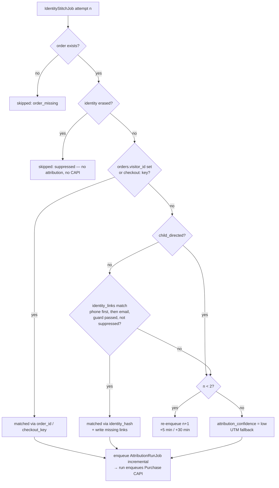

# LLD — Identity stitching

> Names are defined in [HLD §8](../HLD.md#8-cross-cutting-concepts); rules come from [SPEC §7.3](../../SPEC.md#73-identity-stitching-rules). Hashing and suppression come from `packages/privacy` ([privacy-dpdp.md](privacy-dpdp.md)).

## 1. Purpose & scope

This module links visitors, sessions and orders into a journey per shopper, within one store only. It owns:

- **Order stitching** — the `identity-stitch` queue. When an order arrives, it finds the visitor(s) whose touchpoints belong to that order's journey: primary `order_id` match, then the HMAC phone/email fallback, then delayed re-stitch at +5 min and +30 min, then the UTM fallback with `attribution_confidence='low'`. It then triggers the attribution run and the `Purchase` CAPI dispatch.
- **Event-side linking**, called by `event-workers` ([event-pipeline.md](event-pipeline.md)):
  - `linkFromContactEvent` writes `identity_links` rows from checkout contact info;
  - `recordCheckoutVisitor` records the `checkout_completed` → order handoff.
- **Suppression on the stitch path**, including the new-device path: an erased shopper returning on a new device must not be stitched, and the new visitor must be purged.
- `resolveJourneyVisitors(order)` — the visitor set the attribution engine uses ([attribution-engine.md](attribution-engine.md)).

**Non-goals**
- Sessionisation and touchpoint building — [event-pipeline.md](event-pipeline.md).
- Credit computation — [attribution-engine.md](attribution-engine.md).
- DSR identity resolution (the one-hop expansion) — [privacy-dpdp.md §4.3](privacy-dpdp.md#43-dsr--access). It reads the same `identity_links` but is owned there.
- Probabilistic or fingerprint matching. Not in MVP and not planned: SPEC §7.3 is deterministic only.
- Cross-tenant linking. Forbidden (SPEC §7.3 rule 5).

## 2. Interfaces

### 2.1 Queue job
`IdentityStitchJob{storeId, orderId, attempt: 0|1|2}` on queue `identity-stitch` (HLD §8). `orderId` is our `orders.id`, not the Shopify id.
- BullMQ `jobId = stitch:<orderId>:<attempt>`, so a re-delivered webhook can't double-schedule.
- Attempt 1 is delayed 5 min; attempt 2 is delayed 30 min after attempt 1.

### 2.2 Functions (`apps/workers/src/identity/`; shared by the `identity-stitch`, `event-workers` and `attribution-run` processors, so it lives in the Workers app rather than a new package)

```ts
export type StitchOutcome =
  | { kind: 'matched'; via: 'order_id' | 'checkout_key' | 'identity_hash'; visitorIds: string[] }
  | { kind: 'retry'; nextAttempt: 1 | 2; delayMs: number }
  | { kind: 'utm_fallback' }                       // attribution_confidence = 'low'
  | { kind: 'skipped'; reason: 'suppressed' | 'anonymised' | 'order_missing' };

export async function stitchOrder(scope: TenantScope, job: IdentityStitchJob): Promise<StitchOutcome>;

// Called by event-workers inside its batch (event-pipeline §4.1 steps 10–12)
export function linkFromContactEvent(e: {
  storeId: string; visitorId: string; occurredAt: string;
  phoneHmac?: VersionedHmac; emailHmac?: VersionedHmac;
}): IdentityLinkRow[];                              // 0–2 rows, one per hash

export function recordCheckoutVisitor(e: {
  storeId: string; visitorId: string; externalOrderId: string;
}): { pgUpdate: SqlStatement; redisSet: RedisCommand };

// Used by the attribution engine
export async function resolveJourneyVisitors(scope: TenantScope, order: OrderRow): Promise<{
  visitorIds: string[];                            // primary first
  via: 'order_id' | 'identity_hash' | 'none';
}>;
```

```ts
export const IdentityStitchJobSchema = z.object({
  storeId: z.string().uuid(),
  orderId: z.string().uuid(),
  attempt: z.union([z.literal(0), z.literal(1), z.literal(2)]),
}).strict();
```

### 2.3 Downstream jobs it enqueues
- `AttributionRunJob{storeId, mode:'incremental', orderIds:[orderId]}` — `jobId = attr:<orderId>`, so repeats coalesce while waiting. The incremental attribution run then enqueues the `Purchase` CAPI job (HLD §6b; [attribution-engine.md §4.2](attribution-engine.md#42-incremental-run)).

No REST endpoints.

## 3. Data owned

| Item | Access | Notes |
|---|---|---|
| ClickHouse `identity_links` | **owns**; insert (event-side and order-side); read `FINAL` | `ReplacingMergeTree(last_seen)` (SPEC v0.2) |
| Postgres `orders` | read; update `visitor_id` (only while `NULL`) and `attribution_confidence` | SPEC v0.2 columns |
| Redis `checkout:<store_id>:<order_id>` | read (written by `event-workers` through `recordCheckoutVisitor`) | HLD §8, pending sign-off |
| Redis `suppress:*` | read (through `SuppressionClient`) | HLD §8 |
| Postgres `stores` | read `child_directed` | |

No new tables, keys or queues.

## 4. Processing flow

### 4.1 Event side (runs inside `event-workers`)
1. `checkout_contact_info_submitted` / `checkout_completed` carrying `phone_hmac` and/or `email_hmac` → `linkFromContactEvent` returns one `identity_links` row per hash: `(store_id, visitor_id, hash, first_seen = last_seen = occurred_at)`. `ReplacingMergeTree(last_seen)` keeps the latest `last_seen` per `(store, visitor, hash)`.
   - `first_seen` is carried by the first insert. `ReplacingMergeTree` keeps the row with the highest `last_seen`, so readers take `min(first_seen)` from the grouped query, not from the surviving row.
2. `checkout_completed` with `properties.order_id` → `recordCheckoutVisitor`:
   - `UPDATE orders SET visitor_id=$v WHERE store_id=$s AND external_order_id=$o AND visitor_id IS NULL`;
   - `SET checkout:<s>:<o> <v> EX 86400`.
   - The pixel's order id is normalised to Shopify's numeric id: any `gid://shopify/<Type>/<n>` form becomes `<n>`, and a plain numeric string is kept. Shopify's docs don't state the format of `checkout.order.id` ([checkout_completed](https://shopify.dev/docs/api/web-pixels-api/standard-events/checkout_completed)), so the normaliser accepts both. A dev-store test confirms the actual value.
   - `checkout_completed` can be missing: if the Thank-you or first upsell page fails to load it never fires (same source). That is one reason the +5 / +30 min retries and the HMAC fallback exist.
3. Rotation window (privacy-dpdp §4.1): if the Collector supplied hashes for several key versions, one row per version is written.

### 4.2 Order side — `stitchOrder`
Triggered by Core API on `orders/create` (and on `orders/updated` when `visitor_id` is still `NULL` and `attempt` 0 has not run), and by the Shopify backfill ([shopify-integration.md](shopify-integration.md)).

1. Load the order through the scoped repository. Missing → `skipped/order_missing` (acked; the backfill or reconciliation will re-create it).
2. **Suppression gate.**
   - If `phone_hash_hmac` and `email_hash_hmac` are both `NULL` (anonymised, or the identity was suppressed at webhook time — HLD §6b) → `skipped/anonymised`. Still enqueue attribution, which will produce Unattributed.
   - If either hash is in `suppress:<s>:erased:identity` → `skipped/suppressed`, with no attribution or CAPI.
3. **Rule 2 — primary.**
   - `orders.visitor_id` already set (the event arrived first and hit the `UPDATE`) → matched via `order_id`.
   - Else `GET checkout:<s>:<external_order_id>` → if present, set `orders.visitor_id` (guarded by `IS NULL`) → matched via `checkout_key`.
   - A visitor found here is still checked against the erased and withdrawn visitor sets (`HMAC(visitor_id)`); a suppressed visitor is dropped from the result.
4. **Rule 3 — HMAC fallback** (skipped when `stores.child_directed = true`, pending privacy-dpdp Open question 1):
   - Query `identity_links FINAL WHERE store_id=? AND identity_hash_hmac IN (phoneHmac, emailHmac)`.
   - **Phone first**: if any rows match the phone hash, use only those; otherwise use the email-hash rows.
   - Remove suppressed visitors.
   - **Dummy numbers never reach this step.** The blocklist (repeated digits, repeated two-digit blocks, ascending or descending runs such as `1234567890`, plus a platform list) is applied in `normalisePhone` before hashing ([privacy-dpdp.md §4.1](privacy-dpdp.md#41-hashing-the-tenant-key-and-key-rotation)), so such orders have no phone HMAC at all.
   - **Low-quality identifier guard** (for shared numbers that look real): if the chosen hash links more than **20 visitors**, or appears on more than **50 orders in 90 days**, treat it as a shared or dummy identifier and ignore it. Examples: `9999999999`, a store's own number, a courier agent's phone entered for many COD orders. The guard uses `uniqExact(visitor_id)` on `identity_links` and a `count(*)` on `orders`, both scoped by store. It is checked before the result is used.
   - Keep visitors whose `min(first_seen) ≤ order.created_at_platform`; journeys cannot include activity that started after the order.
   - If one or more remain → matched via `identity_hash`. Also write `identity_links` rows `(visitorId, orderHash)` for each order hash not already linked to that visitor, so later lookups by the other hash also work.
5. **No match** →
   - `attempt < 2`: re-enqueue `IdentityStitchJob{attempt: attempt+1}` with delay 5 min (to attempt 1) or 30 min (to attempt 2) → outcome `retry`. The delays cover `checkout_completed` arriving late (pixel batching, network), `event-workers` lag, and the webhook arriving before the pixel event.
   - `attempt = 2`: UTM fallback (rule 4). Set `orders.attribution_confidence='low'` → outcome `utm_fallback`. The attribution engine builds the fallback touchpoint from `orders.landing_site` / `referring_site` / `note_attributes`.
6. On `matched` or `utm_fallback`:
   - `matched` also sets `orders.attribution_confidence='high'` (a later match can upgrade a `low`).
   - Enqueue `AttributionRunJob` (incremental). The run enqueues `Purchase` CAPI; `capi-dispatch` performs its own consent, suppression and child-directed checks ([meta-integration.md](meta-integration.md)).
7. On `retry`, nothing is enqueued downstream yet. The order is shown as "attribution pending" on the journey view for up to ~35 min.



### 4.3 `resolveJourneyVisitors` (used by attribution)
1. Start with `orders.visitor_id` if set.
2. Unless `child_directed`, add visitors linked through the order's phone hash (or its email hash if no phone links exist), applying the same guard, suppression filter and `first_seen ≤ order time` filter as §4.2 step 4.
3. Cap at **10 visitors**, keeping the primary visitor plus the most recent by `last_seen` (bounds touchpoint loads).
4. `via = 'order_id'` if the primary visitor exists, `'identity_hash'` if only fallback visitors exist, else `'none'`.

This runs at every attribution run, including the nightly 45-day recompute. A cross-device link discovered *after* the purchase (the same phone entered later on another device) is therefore picked up without re-stitching.

### 4.4 New-device suppression path
This must hold for an erased shopper on a new device:
1. The Collector sees the erased `identity_hash_hmac`, drops the event, adds `HMAC(visitor_id)` to the erased visitor set, and emits `suppression_hit` ([collector.md](collector.md) step 10).
2. `event-workers` persists the suppression and enqueues the follow-up `DsrJob{visitorIds}`, which deletes the new visitor's earlier events and `identity_links` ([privacy-dpdp.md §4.4](privacy-dpdp.md#44-dsr--erasure-hld-6d-and-follow-up) step 9).
3. The shopper's order webhook reaches Core API, which sees the erased identity and stores the order with null hashes and null `visitor_id` (HLD §6b).
4. `stitchOrder` → `skipped/anonymised` or `skipped/suppressed`. It never reads the `checkout:` key into `orders.visitor_id` for such an order, because step 2 runs before step 3 of §4.2.
5. If the `checkout:` key or `orders.visitor_id` somehow points at the new visitor, step 3's visitor suppression check drops it.

Result: no journey, no attribution beyond Unattributed revenue, no CAPI, and no surviving pixel data for the new device.

## 5. Failure modes

| Failure | Behaviour | Idempotency |
|---|---|---|
| ClickHouse or Redis unavailable | Job fails → BullMQ backoff (2 s base, 5 attempts) → `identity-stitch-failed`. The nightly attribution recompute still resolves visitors through `resolveJourneyVisitors`, so a lost stitch job only delays `attribution_confidence` and the CAPI `Purchase` | `jobId` per attempt |
| `suppress:ready` absent | Queue paused (HLD §8); jobs wait | — |
| The webhook redelivers `orders/create` | Core API enqueues attempt 0 again; `jobId` dedupes | `stitch:<orderId>:0` |
| Order arrives from backfill (no pixel data exists) | All three attempts are pointless. The backfill enqueues with `attempt: 2`, so it goes straight to rule 3 and then the UTM fallback | — |
| Race: the pixel event is processed between attempts | The next attempt's step 3 finds `orders.visitor_id` | — |
| Shared or dummy phone | Guard ignores it; logged as metric `identity_guard_rejected_total` (no identifier in labels) | — |
| `checkout:` key expired (webhook > 24 h late) | Falls to rule 3; `orders.visitor_id` may already be set by the event-side `UPDATE` if the order existed | — |

## 6. Privacy touchpoints

| ID | How |
|---|---|
| SPEC §7.3 rule 5 | Every query is scoped by `store_id` through the query builder (ADR-0016). HMAC keys are per tenant, so the same phone produces different hashes in different stores. Cross-tenant joins are impossible even by mistake. |
| §5.4 | Only HMACs are handled; no raw identifiers. |
| P-5 | Stitching serves `attribution_analytics`. Only events already accepted with that purpose exist to be stitched. |
| P-6 | Child-directed stores skip the HMAC fallback (rule 3), pending legal confirmation (privacy-dpdp Q1). |
| Erasure / withdrawal | Suppression gate at job execution (§4.2 steps 2–3), and suppressed visitors filtered out of every visitor set. The new-device path is §4.4. |
| S-4 | Stitching itself isn't audited (no human access). Personal-data *views* of the result (the journey endpoint) are audited in [reporting-api.md](reporting-api.md). |

## 7. Performance & limits

| Item | Target |
|---|---|
| `stitchOrder` | p95 < 200 ms (one Postgres read, one Redis `GET`, one to two ClickHouse point queries on the `(store_id, …)` primary key) |
| Throughput | ≥ 50 orders/s per worker; well above MVP peaks (design partners: ~2,000 orders/day, sale-day peaks ~10×) |
| Delays | +5 min, +30 min; worst-case time to final outcome ~35 min |
| Guard thresholds | 20 visitors per hash, 50 orders per hash in 90 days (**needs design-partner data**; COD agent-entered phones may need a lower order threshold) |
| Visitor cap per journey | 10 |
| `identity_links` growth | ≤ 2 rows per identified visitor per key version |

## 8. Test plan

**Unit**
- Rule order: order_id beats checkout key, which beats the HMAC fallback.
- Dummy phones (`9999999999`, `1234567890`, `9876543210`, `9898989898`) produce no HMAC and never link.
- Phone-first selection.
- The guard trips at 21 visitors or 51 orders.
- `first_seen` after the order time is excluded.
- Visitor cap of 10.
- Child-directed skips rule 3.

**Integration** (Postgres, ClickHouse, Redis)
1. Webhook before pixel: attempt 0 no match → pixel event processed → attempt 1 matches via `orders.visitor_id`.
2. Pixel before webhook: attempt 0 matches via the `checkout:` key.
3. Cross-device: a mobile in-app browser session plus desktop Chrome checkout with the same phone → both visitors in `resolveJourneyVisitors`.
4. No pixel data → after attempt 2, `attribution_confidence='low'`, and exactly one `AttributionRunJob`.
5. New-device erased shopper (§4.4) → no `identity_links` rows for the new visitor after the follow-up job; the order is anonymised; no CAPI job.
6. Erasure while attempt 2 is delayed → attempt 2 returns `skipped`.
7. Two stores sharing a customer phone → different HMACs, no link.

**§5.10 compliance tests supported**
- Test 2 (no CAPI after withdrawal): the visitor suppression filter.
- Test 5 (erasure incl. new device): §4.4.
- Test 7 (cross-tenant): scenario 7 above.

## 9. Open questions
1. **Child-directed stores**: disable the HMAC fallback? Currently implemented as "skip" pending legal (privacy-dpdp Q1).
2. **Guard thresholds** (§7) need calibrating on real COD data. Should merchants be able to see and whitelist a flagged identifier (for example a genuine repeat buyer with 60 orders)? Proposed: not in MVP.
3. **Email fallback when a phone matches nothing new.** SPEC says "phone first, then email". This design uses email only when the phone has *no* links. The alternative is the union of both. The union stitches more but risks over-merging shared family emails. Proposed: phone-first as written.
4. **Pixel order id format** (`checkout.order.id`) is not documented. The normaliser handles both a GID and a numeric id; confirm in a dev store.
5. **Placeholder emails.** COD checkouts often collect filler emails (`noemail@gmail.com`, `test@test.com`, `na@na.com`). Add an email blocklist alongside the phone one? Proposed: yes, as a platform list in `packages/shared/constants.ts` (needs design-partner data to seed).
